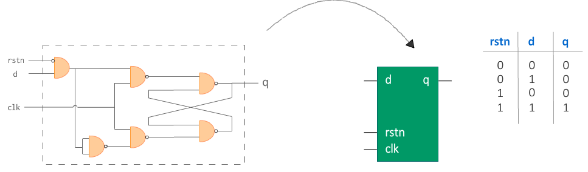
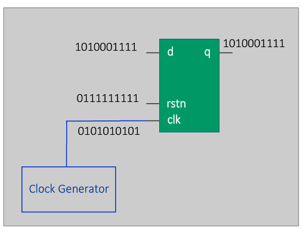

# Verilog 引入

一个电子元件(digital element)，比如说触发器(flip-flop)，可以通过逻辑门(logical gates)，比如说与或非门，的组合来表示。一个特定电子元件的功能可以通过将特定的一些逻辑门以一种特定的方式连接在一起来实现。将哪些逻辑门以怎样的方式连接在一起通常是从真值表中化简得到的。真值表是一张描述从输入信号到输出信号映射的表格。

下图中是一张D触发器的电路图以及它对应的真值表。输出 `q` 只有当 `rstn` 和 `d` 都是1的时候才为 `1` 。

<p style="text-align:center"></p>

## 硬件原理图是什么？

**硬件原理图(hardware schematic)** 是表示如何组织逻辑门以实现特定硬件功能的图表。在上面的例子中，它是由一组与门和非门连接而成的，如上图左侧所示。

但是，如果我们知道哪些输入值会使输出值为1，那么我们基本上可以隐藏连接的内部细节并将其封装到黑盒中。这个黑盒为我们提供了类似于由组合门组成的硬件原理图的某些输入和输出，只不过中间变成了一个盒子而已，比如说上图中间的那种表示方法。

## 硬件描述语言是什么？

如果我们可以描述这个黑盒应该有怎样的行为，然后让软件工具将该行为转换为实际的硬件原理图，对于设计者来说，将会轻松很多。我们将要学习的描述硬件功能的语言称为 Verilog，属于硬件描述语言。

## 设计功能是什么意思？

D触发器的一些典型行为要求是：

- 时钟(clock)应该是触发器的输入；
- 如果低电平有效复位(active-low reset)为 0，则触发器应复位；
- 如果低电平有效复位为 1，则触发器输出“q”应与输入“d”相同；
- 输出“q”应该只在时钟的上升沿(posedge)得到一个新值；

有了硬件描述语言，我们只需要用 Verilog 将上面的行为要求描述出来即可，也就是 **设计功能(design functionality)** ，具体的实现由软件来帮我们完成。

不过，此时应该会想到一个重要的问题：我们如何知道 Verilog 中描述的行为是否准确地反映了设计的预期行为呢？

## 什么是验证？

我们会通过不同的方法对代码进行检查，这个过程统称为 **验证(verification)** 。最常见和广泛应用的验证方法是电路仿真(circuit simulation)。有一些软件工具可以理解 Verilog 中描述的硬件应该如何工作，并为设计模型提供各种输入刺激。然后根据预期值检查设计的输出，以查看设计在功能上是否正确。

所有模拟均由 **EDA(Electronic Design Automation)** 软件工具执行，Verilog 设计 RTL 放置在称为 **测试台(testbench)** 的实体内。在测试台中，各种测试为设计提供了不同的刺激。一个测试台的例子如下图所示：

<p style="text-align:center"></p>

## Verilog 代码组成

所有的行为代码都应该写在关键字 `module` 和 `endmodule` 中间。其余的设计代码将主要遵循给定的模板。


### Verilog 代码模板

1. **模块(module)** 定义和端口表声明；
2. 输入输出 **端口(ports)** 列表；
3. 使用允许的 Verilog 数据类型声明其他信号；
4. 设计可能依赖于其他 Verilog 模块，通过 **模块实例化(module instantiation)** 来创建其他模块的实例；
5. 本模块的实际 Verilog 设计，描述其行为的 **行为代码(behavioral code)** 。

```verilog
module [design name] ( [port list] );

    [list of input ports]
    [list of output ports]

    [declaration of other signals]

    [other module instantiations if required]

    [behavioral code for this module]

endmodule
```

### 示例

下面展示的代码描述了 D 型触发器的行为。前几行声明了一个名为 `dff` 的新模块并定义了输入和输出端口。此设计中使用的唯一其他信号是 `q` ，在下一行声明。由于这是一个简单的设计，它不依赖于任何其他模块，因此没有模块实例化。 `always` 语句块描述了硬件在某些事件期间应该如何表现，因此是行为代码。

```verilog
// "dff" is the name of this module
module dff (input   d,
                    rstn,
                    clk, // Inputs to the design should start with "input"
            output  q); // Outputs of the design should start with "output" 
    // Declare a variable to store output values
    reg q;                          
    // This block is executed at the positive edge of clk 0->1
    always @ (posedge clk) begin
        if (!rstn)
            q <= 0; // At the posedge, if rstn is 0 then q should get 0
        else
            q <= d; // At the posedge, if rstn is 1 then q should get d
    end
endmodule // endof module
```

## 测试台代码

测试台是 Verilog 的容器模块，它允许我们使用不同的输入来驱动设计（其他的verilog模块）并监控其输出的预期行为。

在下面的示例中，我们实例化了上述触发器设计，并将其与 `tb_*` 表示的测试台信号连接起来。然后为这些测试台信号分配特定值，并最终作为设计的输入驱动。

```verilog
module tb:
    // 1. Declare input/output variables to drive the design
    reg tb_clk;
    reg tb_d;
    reg tb_rstn;
    wire tb_q;

    // 2. Create an instance of the design
    // This is called design instantiation
    dff dff0(   .clk    (tb_clk),   // Connect clock input with TB signal
                .d      (tb_d),     // Connect data input with TB signal
                .rstn   (tb_rstn),  // Connect reset input with TB signal
                .q      (tb_q));    // Connect output q with TB signal

    // 3. The following is an example of  a stimulus
    // Here we drive the signals tb_* with certain values
    // Since these tb_* signals are connected to the design inputs,
    // the design will be driven with the values in tb_*
    initial begin
        tb_rstn <=  1'b0;
        tb_clk  <=  1'b0;
        tb_clk  <=  1'b0; 
    end
endmodule
```


