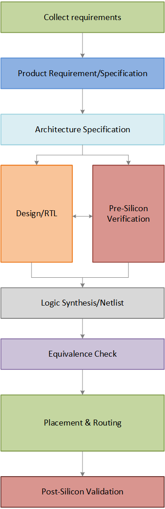
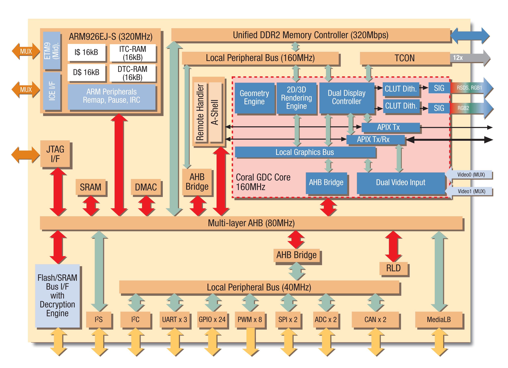
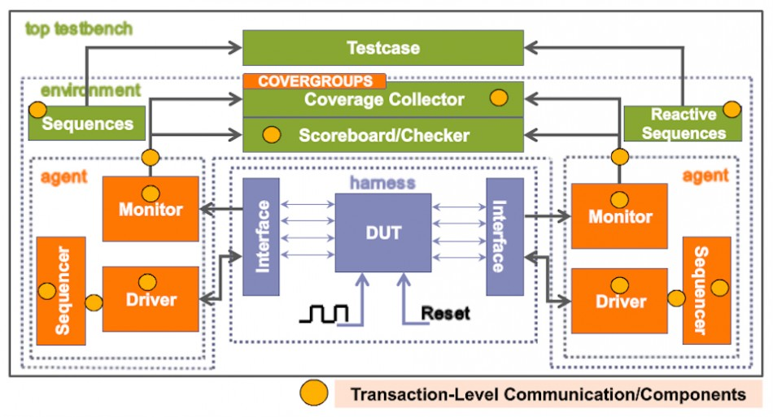
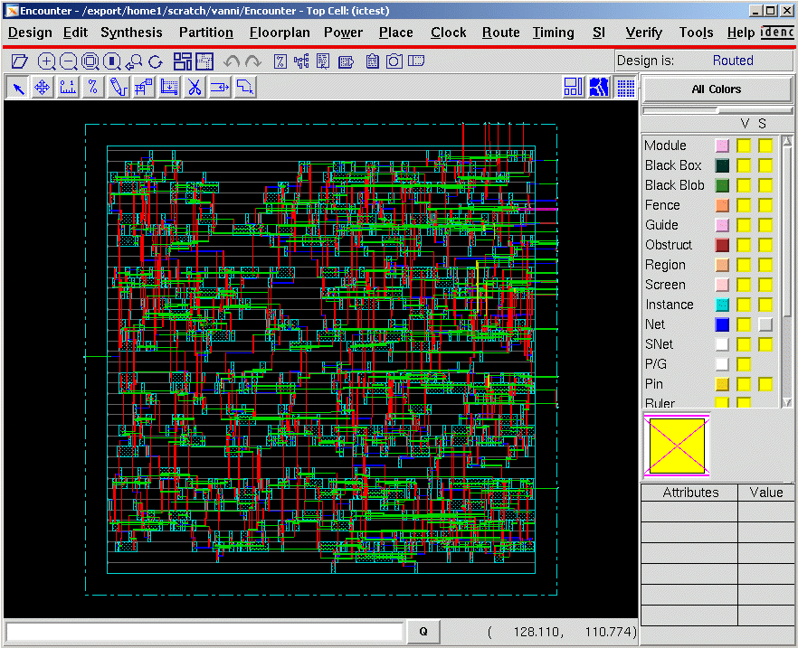
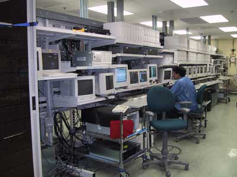

# 芯片的设计流程

典型的设计流程遵循如下所示的结构，并且可以分解为多个步骤。其中一些阶段是并行发生的，一些是顺序发生的。我们将看看当今行业中典型的项目设计周期是什么样的。

<p style="text-align:center"></p>


## 确定要求

半导体公司的客户通常是计划在其系统或最终产品中使用该芯片的其他公司。因此，客户的要求在决定如何设计芯片方面也起着重要作用。自然，第一步是收集需求，估计最终产品的市场价值，并评估完成项目所需的资源数量。

## 收集规约

下一步是收集“规约”，抽象地描述要设计的芯片的功能、接口和整体架构。这可能是像这样一些东西：

1. 需要计算能力来运行成像算法以支持虚拟现实；
2. 需要两个具有一致互连的 ARM A53 处理器，并且应该以 600 MHz 运行；
3. 需要 USB 3.0、蓝牙和 PCIe 第二代接口；
4. 应支持带有适当控制器的 1920x1080 像素显示。

## 设计架构

现在，架构师提出了芯片应该如何运行的系统级视图。他们将决定所需的所有其他组件、它们应该运行的时钟频率以及如何对标功率和性能要求。他们还决定数据应如何在芯片内部流动。

<p style="text-align:center"></p>

## 数字设计

由于现代芯片的复杂性，不可能从头开始构建一些东西，而且在很多情况下，很多组件会被重复使用。假设 X 公司需要一个 FlexCAN 模块来与汽车中的其他模块进行交互。他们可以从另一家公司购买 FlexCAN 设计以节省时间和精力，也可以花费资源自行构建。

此外，用触发器和 CMOS 晶体管等基本构建块来设计这样的系统是不切实际的。相反，开发行为描述以使用诸如 Verilog 或 VHDL 之类的硬件描述语言从功能、性能和其他高级问题方面分析设计。这通常由数字设计师完成，类似于具备数字电子技能的高级计算机程序员。

```verilog
module checker(clk, rst, i, o);
    parameter I_WIDTH = 2;
    parameter X_WIDTH = 2;
    parameter S_WIDTH = 3;
    input clk;
    input rst;
    input [I_WIDTH - 1:0] i;
    output o;
    localparam INIT = 3'b001;
    reg [S_WIDTH - 1:0] s;
    wire [X_WIDTH - 1:0] x;
    wire [S_WIDTH - 1:0] n;
    always @(posedge clk or posedge rst)
        if (rst)
            s <= INIT;
        else
            s <= n;
    assign x[0] = i[0];
    assign x[1] = i[1];
    assign n[0] = 1'b0;
    assign n[1] = s[0] & x[0];
    assign n[2] = s[1] & x[1];
    assign o = ~rst & (s[2]);
endmodule
```

## 硅前验证

当 RTL(Register Transfer Level) 设计准备就绪之后，就需要验证其功能正确性。例如，DSP 处理器预计会发出总线事务以从内存中获取指令，但我们如何知道这会按预期发生呢？因此，此时需要进行功能验证，这是在 EDA 仿真器的帮助下完成的，该仿真器能够对设计进行建模并对其应用不同的激励。这是硅前验证(pre-silicon verification)工程师的工作。

<p style="text-align:center"></p>

为了节省时间和实现功能收敛，设计和验证团队并行运作，设计人员“发布”一个 RTL 版本，验证团队开发测试台环境和测试用例以测试该 RTL 版本的功能。如果这些测试中的任何一个失败，则可能表明设计存在问题，并且该设计元素将出现“错误”。此错误必须在设计团队的下一版本 RTL 版本中修复。这个过程一直持续到对设计的功能正确性有很好的信心为止。

## 逻辑综合

现在我们对设计感到满意，是时候将其转换为具有真实元素（如组合门和触发器）的硬件原理图了。此步骤称为 **综合(synthesis)** 。逻辑综合工具可以将 HDL 中的 RTL 描述转换为门级网表(gate level netlist)。这个网表只不过是根据门和它们之间的连接来描述电路。它可能看起来像：

```verilog
and_2_0     u_and2_0 ( .in_a (_net_112),
                       .in_b (_net_56),
                       .out  (_net_222));

ff_lt       u_ff_lt_122 (.d   (_net_222),
                         .clk (_net_11),
                         .q   (_net_76));
```

逻辑综合工具确保网表符合时序、面积和功率规范。通常，他们可以访问不同的技术节点流程和数字元素库，并且可以进行智能计算以满足所有这些不同的标准。这些库是从半导体工厂获得的，它们提供不同组件的数据特征，例如触发器的上升/下降时间、组合门的输入输出时间等。

## 逻辑等价性

然后检查门级网表与 RTL 的逻辑等效性，有时会执行“门级验证”，其中再次完成某些特定元素的验证，不同之处在于这次它在门级并且处于较低级别的抽象。由于在此阶段设计中涉及大量元素以及反向标注的延迟信息，因此仿真时间往往较慢。

## 布局和布线

然后将网表输入物理设计流程，在 EDA 工具的帮助下完成自动布局和布线（APR 或 PnR）。此类工具的一个很好的例子是 Cadence Encounter 和 Synopsys IC Compiler。这将选择标准单元并将其放置到行中，定义输入输出的球图，创建不同的金属层，并放置缓冲区以满足时序要求。完成此过程后，将生成布局并通常将其送去制造。这个阶段通常由精通技术节点和物理实现细节的物理设计团队处理。

<p style="text-align:center"></p>

## 硅后验证

到这里还没有结束。样品芯片将由同一家半导体公司制造，或发送给台积电或 Global Foundries 等第三方代工厂。该样品将经历硅后验证过程，另一个工程师团队会在测试仪上运行不同的模式。在硅后验证中进行调试比在硅前验证中调试要困难得多，这是因为芯片内部节点的可见性水平大大降低了。此外，一百万个时钟周期将在一秒钟内完成，追溯错误的确切时间将非常耗时。如果在此阶段发现任何实际问题或设计错误，则必须在 RTL 中修复，重新验证，并且必须执行随后的所有步骤。

<p style="text-align:center"></p>

尽管设计流程中有多个步骤，但很多设计活动通常集中在电路 RTL 描述的优化和验证上。需要注意的是，尽管 EDA 工具可用于自动化流程，但使用不当会导致设计效率低下，因此设计人员必须在设计过程中做出有意识的选择。

