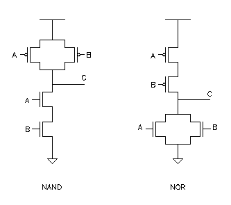

# 芯片的抽象层次

在我们了解 Verilog 语言的更多细节之前，最好了解一下芯片设计中的不同抽象层。

顶层是系统级架构，它定义了各种子块并根据功能对它们进行分组。例如，处理器集群将具有多个核、缓存块和缓存一致性逻辑。所有这些都将被封装并表示为具有输入输出信号的单个块。

在下一个级别，每个子块都用硬件描述语言编写，以准确描述每个单独块的功能。在此阶段忽略电路原理图、技术库等较低级别的实现细节。例如，一个控制器块最终将有多个 Verilog 文件，每个文件描述其功能的一个较小组件。

然后将 HDL 转换为门级原理图，其中还涉及表征触发器等数字元素的技术库。例如，用于 D 锁存器的数字电路包含以某种方式排列的 NAND 门，这样 D 和 E 输入的所有组合都会产生由真值表给出的输出 Q。

真值表本质上给出了所有输入信号电平的排列和由此产生的输出电平，下面给出的是带有使能引脚的 D 锁存器。硬件原理图也可以使用布尔逻辑和 K-map 从真值表中导出。但是，对于更复杂的数字模块（如处理器和控制器）采用这种方法是不切实际的。

与非门的实现是通过以特定方式连接 CMOS 晶体管来完成的。在这个级别上，晶体管沟道宽度、Vdd 和驱动输出电容负载的能力在设计过程中被考虑在内。

最后一步是使用 EDA 工具在硅中布局这些晶体管，以便可以制造。在这个级别上，需要一些设备和技术知识，因为不同的布局最终具有不同的物理特性，例如电阻和电容等。

## 设计风格

其次，数字块的设计主要遵循两种风格，即自上而下(top-down)和自下而上(bottom-up)的方法。

- 自顶向下
    - 在这种风格中，首先定义一个顶层块以及构建顶层块所需的子模块的标识。类似地，每个子块被进一步划分为更小的组件，并且该过程一直持续到我们到达叶单元或无法进一步划分的阶段。
- 自下而上
    - 在这种情况下，首要任务是识别可用的构建块。然后将它们放在一起并以某种方式连接以构建更大的单元，并用于拼凑顶级块。

通常，使用两种风格的组合。架构师定义设计的系统级视图，设计人员实现每个功能块的逻辑并合成门。到此为止一直遵循自上而下的风格。然而，这些门是按照自下而上的流程构建的，从最小块的物理布局开始，以尽可能好的面积、性能和功率方式。这些标准单元还具有硬件原理图，可用于获取各种信息，例如上升和下降时间、功率和其他延迟；可供综合工具使用，综合工具会在需要时选择并实例化它们。

