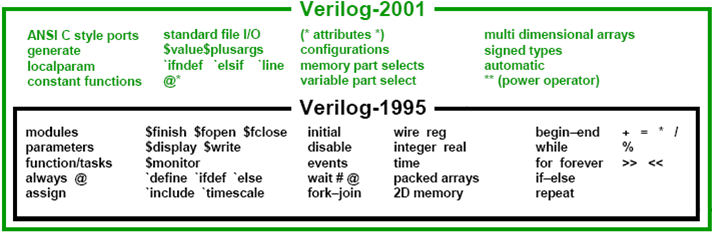

# Verilog 语法

Verilog 中的词法规约类似于 C，因为它包含一个标记(token)流。词法标记可以由一个或多个字符组成，标记可以是注释、关键字、数字、字符串或空格。所有行都应以分号 ; 结尾。

::: tip
Verilog 是大小写敏感的，所以 `var_a` 和 `var_A` 是不同的标识符。
:::

## 注释

在 Verilog 中有两种写注释的方法。

1. 单行注释以 `//` 开头，并告诉 Verilog 编译器将此点之后到行尾的所有内容都视为注释。
2. 多行注释以 `/*` 开头，以 `*/` 结尾，不能嵌套。

但是，单行注释可以嵌套在多行注释中。

```verilog
// This is a single line comment

integer a;  // Creates an int variable called a, and treats everything to the right of // as a comment

/*
This is a
multiple-line or
block comment
*/

/*This is /*
an invalid nested
block comment */
*/

/* However,
// this one is okay
*/

// This is also okay
////////////// Still okay
```

## 空白符

空白(white space)是用于描述空格、制表符、换行符和换页符等字符的术语，并且通常被 Verilog 忽略，除非它分隔标记(token)。事实上，这有助于代码的缩进，使其更易于阅读。

```verilog
module dut; // 'module' is a keyword
            // 'dut' is an identifier
  reg [8*6:1] name = "Hello!";
  // The 2 spaces in the beginning are ignored
```

但是，字符串中不会忽略空格（来自 space 键）和制表符（来自 TAB 键）。在下面的示例中，名为 `addr` 的字符串变量获取值 “Earth ” ，因为字符串中保留了空格。

```verilog
    // There is no space in the beginning of this line,
    // but there's a space in the string
    reg [8*6:1] addr = "Earth ";
endmodule
```

## 操作符

有三种类型的运算符：一元(unary)、二元(binary)和三元(ternary)或条件(conditional)运算符。

- 一元运算符应出现在其操作数的左侧；
- 二元运算符应出现在其操作数之间；
- 条件运算符有两个独立的运算符，用于分隔三个操作数。

```verilog
x = ~y;                 // ~ is a unary operator, and y is the operand
x = y | z;              // | is a binary operator, where y and z are its operands
x = (y > 5) ? w : z;    // ?: is a ternary operator, and the expression (y > 5), w and z are its operands
```

如果表达式 (y > 5) 为真，则变量 x 被赋为 w 中的值，否则将被赋为 z 中的值。

## 数字

我们最熟悉用十进制表示的数字。但是，数字也可以用二进制、八进制和十六进制表示。默认情况下，Verilog 模拟器将数字视为十进制。为了以不同的基数表示它们，必须遵循某些规则。

```verilog
16      // Number 16 in decimal
0x10    // Number 16 in hexadecimal
10000   // Number 16 in binary
20      // Number 16 in octal
```

### 带位宽的数字

带位宽的数字格式如下，其中 `size` 用十进制数字表示数字的比特数。

```verilog
[size]'[base format][number]
```

- `base format` 规定了 `number` 的格式，取值可以有：
    - `d` 或者 `D` 表示十进制(decimal)；
    - `b` 或者 `B` 表示二进制(binary)；
    - `o` 或者 `O` 表示八进制(octal)；
    - `h` 或者 `H` 表示十六进制(hexadecimal)。
- `number` 表示数值大小，由数字组成，如果是十六进制，可以有 `A~F` 或者 `a~f` 字母。

```verilog
3'b010; // size is 3, base format is binary('b), and the number is 010 (indicates value 2 in binary)
3'd2; // size is 3, base format is decimal('d), and the number is 2 (specified in decimals)
8'h70; // size is 8, base format is hexadecimal('h), and the number is 0x70 (in hex) to represent decimal 112
9'h1FA; // size is 9, base format is hexadecimal('h), and the number is 0x1FA (in hex) to represent decimal 506

4'hA = 4'd10 = 4'b1010 = 4'o12 // Decimal 10 can be represented in any of the four formats
8'd234 = 8'D234 // Legal to use either lower case or upper case for base format
32'hFACE_47B2; // Underscore (_) can be used to separate 16 bit number for readability
```

当进制位16进制的时候，`a~f` 既可以大些，也可以小写。

```verilog
16'hcafe;   // lowercase letters Valid
16'hCAFE;   // uppercase letters Valid
32'h1D40_CAFE;  // underscore can be used as seperator between 4 letters Valid
```

### 不带位宽的数字

默认情况下，没有规定 `base format` 的数字是十进制数字。没有规定 `size` 的数字具有默认的位数，不过默认的位数是多少取决于模拟器和机器的类型了，当数字被存到变量中的时候，变量的位宽取决于它本身的类型。

```verilog
integer a = 5423;   // base format is not specified, a gets a decimal value of 5432
integer a = 'h1AD7; // size is not specified, because a is int (32 bit) value stored in a = 32'h0000_1AD7
```

### 负数

通过在数字 `size` 前放置一个减号来指定负数。在 `base_format` 和 `number` 之间加负号是非法的。负数会以补码的形式储存。

```verilog
-6'd3;  // 8-bit negative number stored as two's complement of 3
-6'd9;
8'd-4;  // Illegal
```

## 字符串

用双引号“”括起来的字符序列称为字符串。它不能分成多行，并且字符串中的每个字符都需要 1 个字节来存储。

```verilog
"Hello, World!"     // String with 12 characters -> require 12 bytes
"x + z"             // String with 5 characters
"How are you
feeling today ?"    // Illegal for a string to be split into multiple lines
```

## 标识符

标识符是变量的名称，以便以后可以引用它们。它们由字母数字字符 `[a-z][A-Z][0-9]`、下划线 `_` 或美元符号 `$` 组成，并且区分大小写。它们不能以数字或美元符号开头。

```verilog
integer var_a;      // Identifier contains alphabets and underscore -> Valid
integer $var_a;     // Identifier starts with $ -> Invalid
integer v$ar_a;     // Identifier contains alphabets and $ -> Valid
integer 2var;       // Identifier starts with a digit -> Invalid
integer var23_g;    // Identifier contains alphanumeric characters and underscore -> Valid
integer 23;         // Identifier contains only numbers -> Invalid
```

## 关键字

关键字是为定义语言结构而保留的特殊标识符，并且是小写的。下面给出了重要关键字的列表。

```verilog
always      endfunction     input       signed
and         endgenerate     integer     task
assign      endmodule       join        time
automatic   endprimitive    localparam  real
begin       endspecify      module      realtime
case        endtable        nand        reg
casex       endtask         negedge     unsigned
casez       event           nmos        wait
deassign    for             nor         while
default     force           not         wire
defparam    forever         or
design      fork            output
disable     function        parameter
edge        generate        pmos
else        genvar          posedge
end         include         primitive
endcase     initial         specify
endconfig   inout           specparam
```

## Verilog 修改

Verilog 多年来经历了一些修改，从 1995 年到 2001 年进行了更多的补充，如下所示。

<p style="text-align:center"></p>


