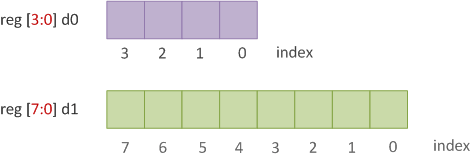

# Verilog 数据类型

Verilog 语言中数据类型的主要目的是表示数据存储元素（如触发器中的位）和传输元素（如连接逻辑门和顺序结构的导线）。

## 变量存放什么值？

除了 `real` 类型和 `event` 类型外，几乎所有数据类型都只能存放下面给出的四种不同值之一。

|值|含义|
|:-:|:-:|
| `0` |表示逻辑0或者一个为假的条件|
| `1` |表示逻辑1或者一个为真的条件|
| `x` |表示一个未知的逻辑值（可能是 `0` 或者 `1` ）|
| `z` |表示高阻态(high-impedance state)|

下图显示了这些值如何在时序图和仿真波形中表示。大多数模拟器使用这种约定，红色代表 `x` ，中间的橙色代表高阻抗或 `z` 。

<p style="text-align:center"></p>

## Verilog 设置值意味着什么？

由于 Verilog 本质上用于描述触发器等硬件元素和 NAND 和 NOR 等组合逻辑，因此它必须对硬件中的值系统进行建模。逻辑 1 将表示电压供应 $V_{dd}$ ，其范围可以在 0.8V 到基于制造技术节点的超过 3V 的某个电压值之间。逻辑零表示接地，因此值为 0V。

`X` 或 `x` 表示该值当时只是未知的，可以是 `0` 或 `1`。这与布尔逻辑中处理 `X` 的方式完全不同，在布尔逻辑中 `X` 表示“不关心”。

与任何不完整的电路一样，未连接任何东西的导线在该节点处将具有高阻抗，并由 `Z` 或 `z` 表示。即使在verilog中，任何未连接的电线都会导致高阻抗。`

## 导线与变量

导线和变量是两组主要的数据类型，它们代表不同的硬件结构，并且在赋值和存值的方式上有所不同。

### 导线

导线用于在逻辑门等硬件实体之间进行连接，因此不会自行存储任何值。在下图中，名为 `net_11` 的导线用于连接 AND 门的输出和触发器 `data_0` 的第一个输入。以类似的方式，与门的两个输入连接到导线 `net_45` 和 `net_67`。

<p style="text-align:center"></p>

有不同类型的导线，每种导线具有不同的特性，但在数字设计中最流行和广泛使用的导线是 `wire` 类型。 `wire` 是一种 Verilog 数据类型，用于连接元素和连接由单个门或连续分配驱动的网络。 `wire` 类似于用于连接电路板上两个组件的电线。

<p style="text-align:center"></p>

当需要多导线时，可以将多根导线捆在一起形成一根更粗的单根导线。在下图中，我们有一根 4 位线，可以在每根线上发送 1 个单独的值。这种宽度大于 1 的实体称为向量 `vector` ，我们将在下一章中看到。

```verilog
wire [3:0] n0; // 4-bit wire  -> this is a vector
```

<p style="text-align:center"></p>

重新声明已经由导线、参数或变量声明的名子是非法的，如下面的代码所示。

```verilog
module design;
    wire abc;
    wire a;
    wire b;
    wire c;

    wire abc; // Error: Identifier "abc" previously declared

    assign abc = a & b | c;
endmodule
```

### 变量

<p style="text-align:center"></p>

变量是数据存储元素的抽象，可以保存值。触发器是存储元件的一个很好的例子。

Verilog 数据类型 `reg` 可用于对硬件寄存器进行建模，因为它可以保存值。请注意，`reg` 不一定总是代表触发器，因为它也可以用来代表组合逻辑(combinational)。

在左图中，我们有一个可以存储 1 位的触发器，而右侧的触发器可以存储 4 位。

<p style="text-align:center"></p>

## 其他数据类型

### 整数

整数是 32 位宽的通用变量，可在对硬件建模和存储整数值时用于其他目的。

```verilog
integer count;  // Count is an ingeter value
```

### 时间

`time` 变量是无符号的，64 位宽，可用于存储仿真时间量以进行调试。 `realtime` 只是将时间存储为浮点量。

```verilog
time end_time;  // end_time can be stored a time value like 50ns
realtime rtime; // rtime = 40.25ps
```

### 实数

一个 `real` 变量可以存储浮点值，并且可以像 `integer` 和 `reg` 一样赋值。

```verilog
real float; //float = 12.344 - can store floating numbers
```

## 示例

```verilog
module testbench;
    integer int_a;  // Integer variable
    real    real_b; // Real variable
    time    time_c; // Time variable

    initial begin
        int_a = 32'hcafe_1234;  // Assign an integer value
        real_b = 0.1234567;     // Assign a floating point value

        #20;                    // Advance simulation time by 20 units
        time_c = $time;         // Assign current simulation time

        // Now print all variables using $display system task
        $display("int_a     = 0x%0h", int_a);
        $display("real_b    = %0.5f", real_b);
        $display("time_c    = %0t", time_c);
    end
endmodule
```

仿真模拟日志：

```bash
int_a   = 0xcafe1234
real_b  = 0.12346
time_c  = 20
```

## Verilog 字符串

字符串存储在 `reg` 中， `reg` 变量的宽度必须足够大以容纳字符串。字符串中的每个字符代表一个 ASCII 值，需要 1 个字节（一个字节是8位）。如果变量的大小小于字符串，则 Verilog 会截断字符串的最左侧位。如果变量的大小大于字符串，则 Verilog 会在字符串的左侧添加零。

```verilog
// "Hello World" requires 11 bytes
reg [8*11:1] str = "Hello World";   // Variable can store 11 bytes, str = "Hello World"
reg [8*5:1]  str = "Hello World";   // Variable stores only 5 bytes (rest is truncated), str = "World"
reg [8*20:1] str = "Hello World";   // Variable can store 20 bytes (rest is padded with zeros), str = "         Hello World"
```

这是一个完整的示例，展示了如何模拟上面给出的三个变量。

```verilog
module testbench;
    reg [8*11:1] str1;
    reg [8*5:1]  str2;
    reg [8*20:1] str3;

    initial begin
        str1 = "Hello World";
        str2 = "Hello World";
        str3 = "Hello World";

        $display("str1 = %s", str1);
        $display("str2 = %s", str2);
        $display("str3 = %s", str3);
    end
endmodule
```

`str1` 具有正确的大小来存储字符串 `Hello World` 的所有 11 个字节，因此整个字符串都会被打印出来。然而 `str2` 只能存储 5 个字节，因此前 6 个字节被截断并最终只存储 `World` 。第三个变量 `str3` 大于 11 个字节，并在左侧填充空格，因此存储在其中的值变为 `         Hello World`。

```bash
str1 = Hello World
str2 = World
str3 =          Hello World
```

