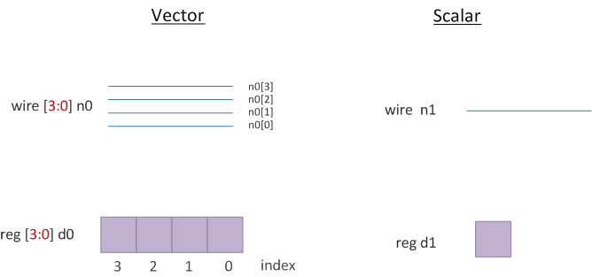
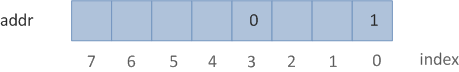
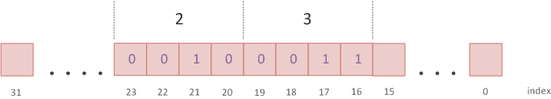

# Verilog 标量与向量

Verilog 需要表示单个比特以及一组比特。例如，一个单比特顺序元件是一般是一个触发器。然而，一个 16 位顺序元件就是一个16 位的寄存器了。为此，Verilog 有标量和向量两种形式的导线和变量。

## 标量与向量

没有规定范围(range)的 `wire` 或 `reg` 声明被认为是 1 位宽并且是标量(scalar)。如果指定了范围，则 `wire` 或 `reg` 就变成了称为向量(vector)的多位实体。

<p style="text-align:center"></p>

```verilog
wire        o_nor;  // single bit scalar net
wire [7:0]  o_flop; // 8-bit vector net
reg         parity; // single bit scalar variable
reg  [31:0] addr;   // 32-bit vector variable to store address
```

指定的范围提供了寻址向量中各个位的能力。向量的最高有效位应指定为范围内的左侧值，而向量的最低有效位应指定为范围内的右侧值。

```verilog
wire [msb:lsb]  name;
integer         my_msb;

wire [15:0]     priority;
wire [my_msb:2] prior;
```

在上面的示例中将创建一个 16 位宽的导线，叫做 `priority` 。请注意，msb（最高位） 和 lsb（最低位） 应该是常量表达式，不能被变量替换。但它们可以是任何整数值——正数、负数或零； lsb 值可以大于、等于或小于 msb 值。

## 位选择

向量变量中的任何位都可以单独选择并分配一个新值，如下所示。这称为位选择(bit-select)。如果位选择超出范围或位选择索引是 `x` 或 `z`，则返回的值将是 `x`。

<p style="text-align:center"></p>

```verilog
reg [7:0]   addr;   // 8-bit reg variable [7, 6, 5, 4, 3, 2, 1, 0]

addr [0] = 1;       // assign 1 to bit 0 of addr
addr [3] = 0;       // assign 0 to bit 3 of addr
addr [8] = 1;       // illegal : bit8 does not exist in addr
```

## 部分选择

<p style="text-align:center"></p>

可以选择一系列连续位，称为部分选择(part-select)。有两种类型的部分选择，一种是常量部分选择，另一种是变量部分选择。

下面是一个常量部分选择的例子：

```verilog
reg [31:0]  addr;
addr [23:16] = 8'h23; // bits 23 to 16 will be replaced by the new value 'h23 -> constant part-select
```

变量部分选择可以在循环中被有效地使用，以选择向量的部分。虽然起始位可以变化，但宽度必须是恒定的。

```verilog
[<start-bit> +: <width>]    // part select increments from start-bit
[<start-bit> -: <width>]    // part select decrements from start-bit
```

下面来看一个完整的例子：

```verilog
module testbench;
    reg [31:0]  data;
    integer     i;

    initial begin
        data = 32'hFACE_CAFE;
        for (i = 0; i < 4; i++) begin
            $display ("data[8*%0d +: 8] = 0x%0h", i, data[8*i +: 8]);
        end

        $display ("data[7:0]   = 0x%0h", data[7:0]);
        $display ("data[15:8]  = 0x%0h", data[15:8]);
        $display ("data[23:16] = 0x%0h", data[23:16]);
        $display ("data[31:24] = 0x%0h", data[31:24]);
    end
endmodule
```

仿真日志：

```bash
data[8*0 +: 8] = 0xfe              # ~ data [8*0+8 : 8*0]
data[8*1 +: 8] = 0xca              # ~ data [8*1+8 : 8*1]
data[8*2 +: 8] = 0xce              # ~ data [8*2+8 : 8*2]
data[8*3 +: 8] = 0xfa              # ~ data [8*3+8 : 8*3]
data[7:0]   = 0xfe
data[15:8]  = 0xca
data[23:16] = 0xce
data[31:24] = 0xfa
```

## 常见错误

```verilog
module tb:
    reg [15:0]  data;

    initial begin
        $display ("data[0:9] = 0x%0h", data[0:9]);
        // Error : Reversed part-select index expression ordering
    end
endmodule
```


