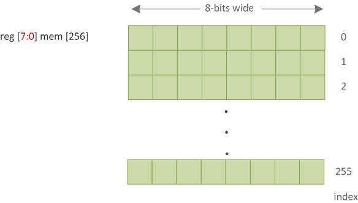
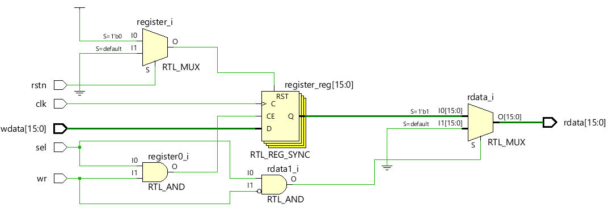
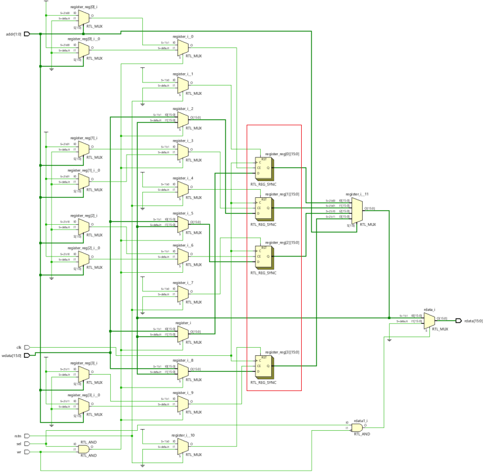

# Verilog 数组与内存

## 数组

导线或变量的数组声明可以是标量或向量。通过在标识符名称后指定地址范围可以创建任意数量的维度，称为多维数组。 Verilog 中允许 `reg` 、 `wire` 、 `integer` 和 `real` 数据类型的数组。

```verilog
reg         y1 [11:0];      // y is an scalar reg array of depth=12, each 1-bit wide
wire [0:7]  y2 [3:0];       // y is an 8-bit vector net with a depth of 4
reg  [7:0]  y3 [0:1][0:3];  // y is a 2D array rows=2, cols=4 each 8-bit wide
```

必须指定每个维度的索引才能访问数组的特定元素，并且可以是其他变量的表达式（但是向量中的选择操作不可以用变量索引）。可以为 Verilog 支持的任何不同数据类型创建一个数组。

::: danger 注意
请注意，n 个 1 位 `reg` 构成的内存(memory)与 n 位 `reg` 向量不同。
:::

### 赋值

```verilog
y1 = 0; // Illegal - All elements can't be assigned in a single go

y2[0] = 8'ha2; // Assign 0xa2 to index=0
y2[2] = 8'h1c; // Assign 0x1c to index=2
y3[1][2] = 8'hdd; // Assign 0xdd to rows=1 cols=2
y3[0][0] = 8'haa; // Assign 0xaa to rows=0 cols=0
```

## 示例

下面的代码简单地显示了如何对不同的数组进行构建、赋值和访问。 `mem1` 是一个 8 位向量， `mem2` 是一个深度为 4 的 8 位数组（由范围 [0:3] 指定）， `mem3` 是一个 4 行 2 列的 16 位向量二维数组。这些变量被赋予不同的值并被打印出来。

```verilog
module des ();
    reg [7:0] mem1;             // reg vector 8-bit wide
    reg [7:0] mem2 [0:3];       // 8-bit wide vector array with depth=4
    reg [15:0] mem3 [0:3][0:1]; // 16-bit wide vector 2D array with rows=4, cols=2

    initial begin
        mem1 = 8'ha9;
        $display ("mem1 = 0x%0h", mem1);

        mem2[0] = 8'haa;
        mem2[1] = 8'hbb;
        mem2[2] = 8'hcc;
        mem2[3] = 8'hdd;

        for (integer i = 0; i < 4; i = i + 1) begin
            $display ("mem2[%0d] = 0x%0h", i, mem2[i]);
        end

        for (integer i = 0; i < 4; i += 1) begin
            for (integer j = 0; j < 2; j += 1) begin
                mem3[i][j] = i + j;
                $display ("mem3[%0d][%0d] = 0x%0h", i, j, mem3[i][j]);
            end
        end
    end
endmodule
```

仿真日志：

```bash
mem1 = 0xa9
mem2[0] = 0xaa
mem2[1] = 0xbb
mem2[2] = 0xcc
mem2[3] = 0xdd
mem3[0][0] = 0x0
mem3[0][1] = 0x1
mem3[1][0] = 0x1
mem3[1][1] = 0x2
mem3[2][0] = 0x2
mem3[2][1] = 0x3
mem3[3][0] = 0x3
mem3[3][1] = 0x4
```

## 内存

内存是数字电路中存储数据和信息的数字存储元件。 RAM 和 ROM 是此类存储元件的常见的实例。存储元素可以使用 `reg` 类型的一维数组进行建模，称为一块内存(memory)。内存中的每个元素都可以表示一个字(word)，并使用单个数组索引进行引用。

<p style="text-align:center"></p>

### 寄存器向量

Verilog 向量是使用变量名左侧的位宽范围声明的，这些向量会使用位宽个数的触发器来实现。在下面的代码中，设计模块接受时钟、复位和一些控制信号来读取和写入块。

它包含一个叫做 `register` 的 16 位存储元件，它在写入期间简单地更新，并在读取期间返回当前值。当 `sel` 和 `wr` 在同一时钟沿为高电平时写入寄存器。当 `sel` 为高且 `wr` 为低时，它返回当前数据。

```verilog
module gpr( input           clk,
            input           rstn,
            input           wr,
            input           sel,
            input [15:0]    wdata,
            output [15:0]   rdata);

    reg [15:0] register;

    always @ (posedge clk) begin
        if (!rstn)
            register <= 0;
        else begin
            if (sel & wr)
                register <= wdata;
            else
                register <= register;
        end
    end

    assign rdata = (sel & ~wr) ? register : 0;

endmodule
```

硬件原理图显示，当写入控制逻辑处于活动状态时更新 16 位触发器，当控制逻辑配置为读取时返回当前值。

<p style="text-align:center"></p>


### 数组

在下面的例子中，`register` 是一个具有四个位置的数组，每个位置的宽度为 16 位。设计模块接受一个称为 `addr` 的附加输入信号来访问数组中的特定索引。

```verilog
module gprs(    input           clk,
                input           rstn,
                input [1:0]     addr,
                input           wr,
                input           sel,
                input [15:0]    wdata,
                output [15:0]   rdata);

    reg [15:0] register [0:3];
    integer i;

    always @ (posedge clk) begin
        if (!rstn) begin
            for (i = 0; i < 4; i = i + 1) begin
                register[i] <= 0;
            end
        end else begin
            if (sel & wr)
                register[addr] <= wdata;
            else
                register[addr] <= register[addr];
        end
    end

    assign rdata = (sel & ~wr) ? register[addr] : 0;

endmodule
```

从硬件原理图中可以看出，数组的每个索引都是一个 16 位的触发器，输入地址用于访问一组特定的触发器。

<p style="text-align:center"></p>


