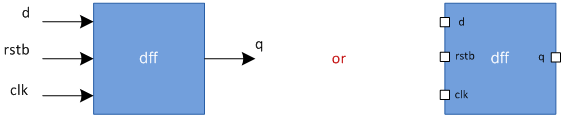

# Verilog 模块

模块是实现特定功能的 Verilog 代码块。模块可以嵌入到其他模块中，更高级别的模块可以使用更低级别的模块的输入和输出端口与其进行通信。

## 语法

模块(module)应包含在 `module` 和 `endmodule` 关键字之间。模块的名称应该紧跟在 `module` 关键字之后，并且还可以声明一个可选的端口(ports)列表。请注意，端口声明列表中声明的端口不能在模块主体内重新声明。

```verilog
module <name> ([port list]);
    // Contents of the module
endmodule

// A module can have an empty port list
module name;
    // Contents of the module
endmodule
```

所有变量声明、数据流语句、函数或任务以及低级模块实例（如果有）都必须在 `module` 和 `endmodule` 关键字之间定义。在同一个文件中可以有多个具有不同名称的模块，并且可以按任意顺序定义。

## 示例

<p style="text-align:center"></p>

模块 `dff` 代表一个 D 触发器，它具有三个输入端口 `d` 、 `clk` 、 `rstn` 和一个输出端口 `q` 。该模块的内容描述了 D 触发器在不同输入组合下的行为方式。这里，如果 `rstn` 为高电平，则输入 `d` 始终在时钟的上升沿分配给输出 `q` ，因为它是低电平有效复位。

```verilog
// Module called "dff" has 3 inputs and 1 output port
module dff( input       d,
            input       clk,
            input       rstn,
            output reg  q);

    // Contents of the module
    always @(posedge clk) begin
        if (!rstn)
            q <= 0;
        else
            q <= d;
    end

endmodule
```

### 硬件示意图

该模块在综合过程中会被转换成下面的数字电路。

<p style="text-align:center"></p>

::: danger 注意
在模块的外部不可以有任何的代码！
:::

## 模块的目的是什么？

模块代表实现某些行为特征的设计单元，并将在综合过程中转换为数字电路。可以为模块提供任何输入组合，它将提供相应的输出。这允许重复使用相同的模块来形成实现更复杂硬件的更大模块。例如，上面显示的 DFF 可以链接起来形成一个移位寄存器。

```verilog
module shift_reg(input   d,
                 input   clk,
                 input   rstn,
                 input   q);
    wire [2:0] q_net;
    dff u0 (.d(d),          .clk(clk), .rstn(.rstn), .q(q_net[0]));
    dff u1 (.d(q_net[0]),   .clk(clk), .rstn(.rstn), .q(q_net[1]));
    dff u2 (.d(q_net[1]),   .clk(clk), .rstn(.rstn), .q(q_net[2]));
    dff u3 (.d(q_net[2]),   .clk(clk), .rstn(.rstn), .q(q));
endmodule
```

### 硬件示意图

如 Verilog RTL 模块所述， `dff` 实例通过导线连接在一起。

<p style="text-align:center"></p>

我们既可以从较小的块构建更大的设计块，也可以将更大的模块分解为较小的模块，这两种设计思路都很常用。

考虑将一个简单的 GPU 引擎分解为更小的组件，以便每个组件都可以表示为实现特定功能的模块。下面显示的 GPU 引擎可以分为五个不同的子块，每个子块执行特定的功能。总线接口单元从外部获取数据到设计中，由另一个单元处理以提取指令。其他后续单位处理前面单位提供的数据。

<p style="text-align:center"></p>

每个子块(sub-block)可以表示为一个 `module` ，具有一定的输入和输出信号集，用于与其他模块通信，每个子块可以根据需要进一步划分为更细的块。

## 什么是顶层模块？

顶层(top-level)模块是包含所有其他模块的模块。顶层(top-level)模块不在任何其他模块中实例化。

例如，设计模块通常在顶层测试平台(testbench)模块中进行实例化，以便可以通过提供输入激励来运行仿真。但是，testbench 没有在任何其他模块中实例化，因为它是一个封装其他所有内容的块，因此是顶层模块。

### 设计顶层模块

下面的设计代码有一个称为 `design` 的顶层模块。这是因为它包含完成设计所需的所有其他子模块。子模块可以有更多的嵌套子模块，如 `mod1` 中的 `mod3` 和 `mod2` 中的 `mod4`。总之，当 `mod1` 和 `mod2` 被实例化时，所有的设计都包含在了顶层模块中。所以这使得 `design` 具有完全性并且是设计的顶层模块。

```verilog
//---------------
// Design Code
//---------------
module mod3 ( [port list] );
    reg c;
    // Design code
endmodule

module mod4 ( [port list] );
    wire a;
    // Design code
endmodule

module mod1 ( [port list] ); // This module called "mod1" contains two instances
    wire y;

    mod3 mod_inst1 ( ... ); // First instance is of module called "mod3" with name "mod_inst1"
    mod3 mod_inst2 ( ... ); // Second instance is of module "mod3" with name "mod_inst2"
endmodule

module mod2 ( [port list] ); // This module called "mod2" contains two instances 
    mod4 mod_inst1 ( ... ); // First instance is of module called "mod4" with name "mod_inst1"
    mod4 mod_inst2 ( ... ); // Second instance is also of module "mod4" with name "mod_inst2"
endmodule

// Top-level module
module design ( [port list] ); // From design perspective, this is the top-level module
    wire _net;                 // since it contains all other modules and sub-modules
    mod1 mod_inst1 ( ... );
    mod2 mod_inst2 ( ... );
endmodule
```

### 测试台顶层模块

测试台模块包含用于检查设计功能的激励，主要用于使用仿真工具进行功能验证。因此，该设计在测试平台模块内被实例化为  `d0` 。从模拟器的角度来看， `testbench` 是顶层模块。

```verilog
//-----------------------------------------------------------
// Testbench code
// From simulation perspective, this is the top-level module
// because 'design' is instantiated within this module
//-----------------------------------------------------------
module testbench;
    design d0 ( [port list connections] );

    // Rest of the testbench code
endmodule
```

## 分层名称

当一个模块可以在另一个模块内部实例化时，一种层次结构就形成了，因此顶层模块也称为根模块。由于给定模块中的每个较低模块实例都需要具有不同的标识符名称，因此在访问信号时不会有任何的歧义。对于层次结构的每个级别，分层名称(hierarchical name)由这些由点 `.` 分隔的标识符的序列构成。任何信号都可以在任何模块中使用该特定信号的分层路径访问。

其实这有一点像面向对象中的属性访问，通过对象名+点+属性名的方式访问对象的成员变量。

```verilog
// Take the example shown above in the top level modules
design.mod_inst1                // Access to module instance mod_inst1
design.mod_inst1.y              // Access signal "y" inside mod_inst1
design.mod_inst2.mod_inst2.a    // Access signal "a" within mod4 module

testbench.d0._net;              // Top level signal _net within design module accesed from testbench
```

