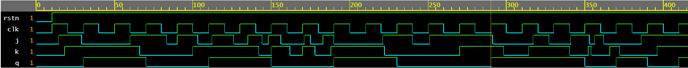
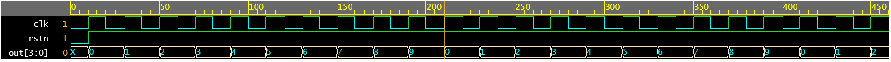
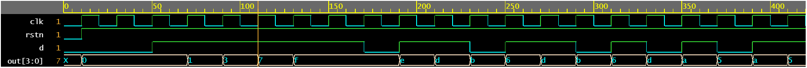

# always 语句块与时序逻辑

上一篇文章展示了使用 `always` 块来实现组合逻辑的不同示例。 `always` 块也主要用于实现时序逻辑，该逻辑具有可以保存值的触发器等存储元件。

## JK 触发器

JK 触发器(flip flop)是用于存储值的多种触发器之一，它有两个数据输入 `j` 和 `k`，一个复位 `rstn`，一个时钟  `clk` 。 JK 触发器的真值表如下所示，通常使用 NAND 门实现。

|rstn|j|k|q|Comments|
|-|-|-|-|-|
|0|0|0|0|When reset is asserted, output is always zero|
|1|0|0|Hold value|When both j and k are 0, output remains the same as before|
|1|0|1|1|When k=1, output becomes 1|
|1|1|0|0|When k=0, output becomes 0|
|1|1|1|Toggle value|When j=1,k=1 output toggles current value|

JK 触发器的行为 Verilog 代码可以编写如下所示：

```verilog
module jk_ff ( input 			j, 				// Input J
               input 			k, 				// Input K
               input 			rstn, 		    // Active-low async reset
               input 			clk, 			// Input clk
               output reg       q); 			// Output Q

	always @ (posedge clk or negedge rstn) begin
		if (!rstn) begin
			q <= 0;
		end else begin
	  	    q <= (j & ~q) | (~k & q);
	    end
    end
endmodule
```

### 测试台

首先声明测试台中使用的所有变量，并使用一个可以驱动到设计（这里包括后面的设计都是指被测试的模块设计）的简单 `always` 块启动时钟。然后实例化设计并将其端口与相应的测试平台变量连接起来。请注意，`q` 是线型，因为它连接到设计的输出，该输出将主动驱动它。设计的所有其他输入都是 `reg` 类型，因此它们可以在诸如 `initial` 的程序块内驱动。

激励部分(其实就是 `initial` 代码块)首先将设计的所有输入初始化为零，然后在一段时间后取消复位。 `for` 循环用于将不同的值驱动到随机时间驱动的 `j` 和 `k`。循环完成后，等待更多时间并完成模拟。

```verilog
module tb;
	// Declare testbench variables
	reg j, k, rstn, clk;
	wire q;
	integer i;
	reg [2:0] dly;

	// Start the clock
	always #10 clk = ~clk;

	// Instantiate the design
	jk_ff u0 (.j(j), .k(k), .clk(clk), .rstn(rstn), .q(q));

	// Write the stimulus
	initial begin
		{j, k, rstn, clk} <= 0;
		#10 rstn <= 1;

		for (i = 0; i < 10; i = i+1) begin
			dly = $random;
			#(dly) j <= $random;
			#(dly) k <= $random;
		end

		#20 $finish;
	end
endmodule
```

从仿真波形中可以看出，在时钟的位置，输出 `q` 会根据真值表中给出的输入 `j` 和 `k` 的状态而改变值。

<p style="text-align:center"></p>

## 模10计数器

模数 (MOD) 计数器在回滚到零之前单纯地计数到某个数字。 MOD-N 计数器将从 0 计数到 N-1，然后回滚到零并重新开始计数。这样的计数器通常需要 $\log_2N$ 个触发器来保存计数值。下面显示的是 MOD-10 计数器的 Verilog 代码，只要复位 rstn 无效，它就会在每个时钟 clk 处保持计数。

Verilog `parameter` 可用于制作更具可扩展性的 MOD-N 计数器，这将会在后续的内容中涉及到。

```verilog
module mod10_counter ( 	input		    clk,
						input 	        rstn,
						output reg[3:0] out);

	always @ (posedge clk) begin
		if (!rstn) begin
			out <= 0;
		end else begin
			if (out == 10)
				out <= 0;
			else
				out <= out + 1;
		end
	end
endmodule
```

### 测试台

测试台首先声明了一些变量，这些变量可以分配一些值并驱动到设计输入。然后计数器模块被实例化并与测试台信号连接，这些信号随后被激励中的一些值驱动。由于计数器还需要时钟，因此测试台时钟使用 `always` 模块进行时钟的建模。激励只是在时间 `0ns` 设置默认值，然后在 `10ns` 后取消置位复位，并允许设计运行一段时间。

```verilog
module tb;
	reg clk, rstn;
	reg [3:0] out;

	mod10_counter u0 (.clk(clk), .rstn(rstn), .out(out));

	always #10 clk = ~clk;

	initial begin
		{clk, rstn} <= 0;

		#10 rstn <= 1;
		#450 $finish;
	end
endmodule
```

我们可以看到计数器模块从 0 计数到 9，翻转到 0 并重新开始计数。

<p style="text-align:center"></p>

## 4位左移寄存器

下图是一个 4 位左移寄存器，它接受一个输入 `d` 到 LSB（least significant bit，最低位），所有其他位都将左移 `1` 。例如，如果 `d` 等于 `0` 并且寄存器的初始值为 `0011` ，它将在时钟 `clk` 的下一个边沿变为 `0110` 。

```verilog
module lshift_4b_reg (  input            d,
                        input            clk,
                        input            rstn,
                        output reg [3:0] out);

    always @ (posedge clk) begin
        if (!rstn) begin
            out <= 0;
        end else begin
            out <= {out[2:0], d};
        end
    end
endmodule
```

### 测试台

测试台遵循与之前所示类似的模板，其中声明了一些变量，设计模块被实例化并与测试台信号连接。然后启动时钟并使用 `initial` 块将激励驱动到设计。在这个测试平台示例中，使用 `for` 循环迭代 `20` 次并将随机值输入给 `d`。

```verilog
module tb;
	reg clk, rstn, d;
	wire [3:0] out;
    integer i;

    lshift_4b_reg u0 (.d(d), .clk(clk), .rstn(rstn), .out(out));

	always #10 clk = ~clk;

	initial begin
        {clk, rstn, d} <= 0;

        #10 rstn <= 1;

        for (i = 0; i < 20; i=i+1) begin
            @(posedge clk) d <= $random;
        end

        #10 $finish;
	end
endmodule
```

注意到每个位都向左移动 1，并将 d 的新值赋给了 LSB。

<p style="text-align:center"></p>

