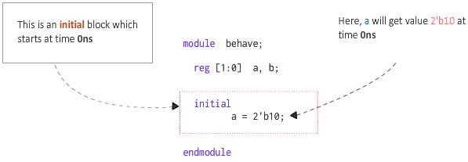
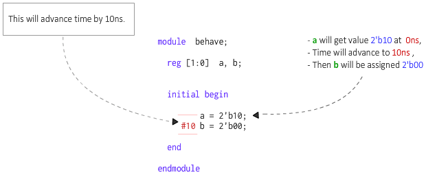
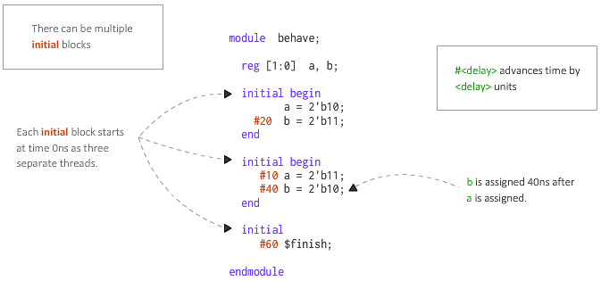

# Verilog initial 语句块

一组 Verilog 语句通常在模拟中顺序执行。这些语句放置在顺序块(procedural block)内。 Verilog 中主要有两种类型的顺序块 - `always` 和 `initial` 。

## 语法

```verilog
initial
	[single statement]

initial begin
	[multiple statements]
end
```

## initial 代码块是用来干什么的？

`initial` 块是不可综合的(unsynthesizable)，因此无法转换为由基本电路元件连接而成的硬件原理图。因此，初始块除了用于模拟之外没有多大用途。这些模块主要用于初始化变量并使用特定值驱动设计端口。

## initial 块什么时候开始和结束？

`initial` 块在模拟开始时（即第0个单位时间的时候）启动。在整个模拟过程中，该块只执行一次。一旦块中的所有语句都执行完毕，初始块的执行就结束了。

<p style="text-align:center"></p>

上图有一个名为 `behave` 的模块，它有两个内部信号 `a` 和 `b`。 `initial` 块只有一个语句，因此没有必要将语句放在 `begin` 和 `end` 之间。当初始块在时刻 0 开始时，此语句将值 `2'b10` 赋给 `a` 。

## 如果有一个延迟语句会怎么样？

下面显示的代码有一个附加语句，它为信号 `b` 分配一些值。然而，这只会发生在前一条语句执行后 10 个单位时间之后。这意味着首先为 `a` 分配给定值，然后在 10 个时间单位后，将 `b` 分配为 `0`。

<p style="text-align:center"></p>

## 一个模块中允许有几个 initial 块？

在模块内定义的 `initial` 块的没有数量限制。

下面的代码有三个初始块，它们都是同时启动并并行(in parallel)运行的。但是，根据每个初始块内的语句和延迟，完成该块所需的时间可能会有所不同。

<p style="text-align:center"></p>

在这个例子中，第一个块有 20 个单位的延迟，而第二个块有 50 个单位 (10 + 40) 的总延迟，最后一个块有 60 个单位的延迟。因此，模拟需要 60 个时间单位才能完成，因为至少有一个初始块仍在运行，直到 60 个时间单位。

::: danger 注意
`$finish` 是一个 Verilog 系统任务，它会告诉模拟器终止当前的模拟。
:::

如果最后一个块有 30 个时间单位的延迟，如下所示，模拟将在 30 个时间单位结束，从而杀死当时处于活动状态的所有其他初始块。

```verilog
initial begin
	#30 $finish;
end
```

