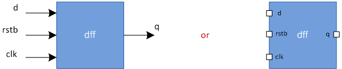

# Verilog 简而言之

Verilog 所有的行为代码都写在 `module` 和 `endmodule` 之间。因此，无论您打算创建什么数字设计，都需要 `module` 块中设计。它可能有也可能没有定义端口。端口允许信号作为 `input` 进入模块或作为 `output` 离开模块。

## 模块

下例中的空模块称为 `testbench`。我们可以随意命名它，但它应该是字母数字，并且可以包含下划线 `_`。

<p style="text-align:center"></p>

```verilog
module testbench;

endmodule
```

让我们看看另一个模块。它有几个信号（ `d` 、 `clk` 、 `rstb` ）被声明为输入， `q` 被声明为输出。

<p style="text-align:center"></p>


```verilog
module dff (input d,
                  clk,
                  rstb,
            output q);

endmodule
```

## 数据类型

现在我们已经了解了模块的外观，让我们再次查看 `testbench` 模块，看看可以在模块中放入什么。 verilog 中主要有两种数据类型：

-  `reg`
-  `wire`

`reg` 数据类型用于保存变量等的值，而 `wire` 类似于导线，必须连续驱动。因此，通常使用 `wire` 连接多个模块和其他信号。

```verilog
module testbench;

	reg d;
	reg rst_b;
	reg clk;

	wire q;
endmodule
```

## 赋值

Verilog 具有三个基本块：

|块|语意|
|-|-|
|`always @ (condition)`|每当 `condition` 满足时执行|
|`initial`|当模拟开始时执行，只执行一次|
|`assign [LHS] = [RHS]`|每当 `RHS` 更改时，`LHS` 的值都会实时更新|

编写 Verilog 时需要牢记一些规则：

-  `reg` 只能在 `initial` 块和 `assign` 块中赋值；
-  `wire` 只能通过 `assign` 语句赋值；
- 如果在 `initial` / `always` 块中有多个语句，它们应该被包裹在 `begin ... end` 之间。

```verilog
module testbench;

	reg d;
	reg rst_b;
	reg clk;

	wire q;

	initial begin
		d = 0;
		rst_b = 0;
		clk = 0;

		#100 $finish;
	end

	always begin
		#10 clk = ~clk;
	end
endmodule
```

请注意上面示例中的以下内容：

- 由于初始块有多行，因此使用了 `begin` 和 `end` ；
- 信号 `d`、`rst_b` 和 `clk` 在 `initial` 内赋值，因为它们的类型为 `reg` ；
- `initial` 块内的代码将在 `0ns` 即仿真开始时执行；
- 由于 `always` 块没有条件，因此它将像 C 中的死循环一样运行；
- `#` 用于表示时间延迟。 `#10` 告诉模拟器让模拟时间向前流动 `10` 个单位。
- `clk = 〜clk;` 将切换时钟的值，由于 `#10` 放在该语句之前，时钟将每 `10` 个单位时间切换（从0变成1或者从1变成0）一次。
- `$finish` 是手动结束模拟的方式，有点像 C 中表示终止进程的 `exit(0)` 函数。在这种情况下，它将运行 `100` 个单位时间并退出。

