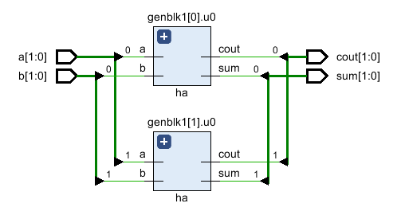

# Verilog generate 语句块

`generate` 块允许增加模块实例或执行任何模块的条件实例化。它提供了基于 Verilog 参数构建设计的能力。当需要多次重复相同的操作或模块实例的时候，又或者必须根据给定的 Verilog 参数有条件地包含某些代码时，这些语句特别方便。

`generate` 块不能包含端口、参数、`specparam` 声明或 `specify` 块。但是，允许使用其他模块项和其他 `generate` 块。所有 `generate` 实例代码都在模块内以及关键字 `generate` 和 `endgenerate` 之间。

`generate` 的实例可以具有模块、连续性赋值、 `always` 或 `initial` 块以及用户定义的基本类型。有两种类型的 `generate` 构造 - 循环式和条件式。

## generate for 循环

半加器将在另一个叫做 `my_design` 的顶层设计模块中使用 `generate` for 循环构造实例化 `N` 次。循环变量必须使用关键字 `genvar` 声明，它告诉工具该变量将在 `generate` 块内专门使用。

```verilog
// Design for a half-adder
module ha ( input   a, b,
            output  sum, cout);
    assign sum  = a ^ b;
    assign cout = a & b;
endmodule

// A top level design that contains N instances of half adder
module my_design
	#(parameter N=4)
		(	input [N-1:0] a, b,
			output [N-1:0] sum, cout);

	// Declare a temporary loop variable to be used during
	// generation and won't be available during simulation
	genvar i;

	// Generate for loop to instantiate N times
	generate
		for (i = 0; i < N; i = i + 1) begin
          ha u0 (a[i], b[i], sum[i], cout[i]);
		end
	endgenerate

endmodule
```

### 测试台

测试台参数用于控制设计中半加器实例的数量。当 `N` 为 `2` 时， `my_design` 将有两个半加器实例。

```verilog
module tb;
    parameter N = 2;
    reg  [N-1:0] a, b;
    wire [N-1:0] sum, cout;

    // Instantiate top level design with N=2 so that it will have 2
    // separate instances of half adders and both are given two separate
    // inputs
    my_design #(.N(N)) md( .a(a), .b(b), .sum(sum), .cout(cout));

    initial begin
        a <= 0;
        b <= 0;

        $monitor ("a=0x%0h b=0x%0h sum=0x%0h cout=0x%0h", a, b, sum, cout);

        #10 a <= 'h2;
                b <= 'h3;
        #20 b <= 'h4;
        #10 a <= 'h5;
    end
endmodule
```

`a[0]` 和 `b[0]` 给出输出 `sum[0]` 和 `cout[0]`，而 `a[1]` 和 `b[1]` 给出输出 `sum[1]` 和 `cout[1]` 。

仿真日志：

```bash
a=0x0 b=0x0 sum=0x0 cout=0x0
a=0x2 b=0x3 sum=0x1 cout=0x2
a=0x2 b=0x0 sum=0x2 cout=0x0
a=0x1 b=0x0 sum=0x1 cout=0x0
```

看到综合成的 RTL 中确实有两个由 `generate` 块生成的半加法器实例。

<p style="text-align:center"></p>

### generate if 语句

下面的示例使用 `generate` 中的 `if else` 在两个不同的多路复用器实现之间进行选择。第一个设计使用 `assign` 语句来实现多路选择器，而第二个设计使用 `case` 语句。在顶层设计模块中定义了一个名为 `USE_CASE` 的参数，用于在两个选项之间进行选择。

```verilog

// Design #1: Multiplexer design uses an "assign" statement to assign
// out signal
module mux_assign ( input a, b, sel,
                   output out);
    assign out = sel ? a : b;

    // The initial display statement is used so that
    // we know which design got instantiated from simulation
    // logs
    initial
        $display ("mux_assign is instantiated");
endmodule

// Design #2: Multiplexer design uses a "case" statement to drive
// out signal
module mux_case (input      a, b, sel,
                 output reg out);
    always @ (a or b or sel) begin
        case (sel)
            0 : out = a;
            1 : out = b;
        endcase
    end

    // The initial display statement is used so that
    // we know which design got instantiated from simulation
    // logs
    initial
        $display ("mux_case is instantiated");
endmodule

// Top Level Design: Use a parameter to choose either one
module my_design (input  a, b, sel,
         		  output out);
    parameter USE_CASE = 0;

    // Use a "generate" block to instantiate either mux_case
    // or mux_assign using an if else construct with generate
    generate
        if (USE_CASE)
            mux_case mc (.a(a), .b(b), .sel(sel), .out(out));
        else
            mux_assign ma (.a(a), .b(b), .sel(sel), .out(out));
    endgenerate

endmodule
```

### 测试台

测试台实例化顶层模块 `my_design` 并将参数 `USE_CASE` 设置为 `1` ，以便它使用 `case` 语句实例化设计。

```verilog
module tb;
	// Declare testbench variables
    reg a, b, sel;
    wire out;
    integer i;

    // Instantiate top level design and set USE_CASE parameter to 1 so that
    // the design using case statement is instantiated
    my_design #(.USE_CASE(1)) u0 ( .a(a), .b(b), .sel(sel), .out(out));

    initial begin
        // Initialize testbench variables
        a <= 0;
        b <= 0;
        sel <= 0;

        // Assign random values to DUT inputs with some delay
        for (i = 0; i < 5; i = i + 1) begin
        #10 a <= $random;
            b <= $random;
            sel <= $random;
        $display ("i=%0d a=0x%0h b=0x%0h sel=0x%0h out=0x%0h", i, a, b, sel, out);
        end
    end
endmodule
```

当参数 `USE_CASE` 为 `1` 时，从仿真日志中可以看出，使用 `case` 语句的多路复用器被实例化。并且当 `USE_CASE` 为零时，使用 `assign` 语句的多路复用器设计被实例化。这可以从仿真日志中打印的语句中看到。

```bash
# When USE_CASE = 1
mux_case is instantiated
i=0 a=0x0 b=0x0 sel=0x0 out=0x0
i=1 a=0x0 b=0x1 sel=0x1 out=0x1
i=2 a=0x1 b=0x1 sel=0x1 out=0x1
i=3 a=0x1 b=0x0 sel=0x1 out=0x0
i=4 a=0x1 b=0x0 sel=0x1 out=0x0
# When USE_CASE = 0
i=0 a=0x0 b=0x0 sel=0x0 out=0x0
i=1 a=0x0 b=0x1 sel=0x1 out=0x0
i=2 a=0x1 b=0x1 sel=0x1 out=0x1
i=3 a=0x1 b=0x0 sel=0x1 out=0x1
i=4 a=0x1 b=0x0 sel=0x1 out=0x1
```

## generate case 语句

`generate` `case` 允许基于 `case` 表达式在另一个模块中实例化模块、`initial` 块和 `always` 块，以选择众多选项中的一个。

```verilog
// Design #1: Half adder
module ha (input a, b,
           output reg sum, cout);
    always @ (a or b)
        {cout, sum} = a + b;

    initial
        $display ("Half adder instantiation");
endmodule

// Design #2: Full adder
module fa (input a, b, cin,
           output reg sum, cout);
    always @ (a or b or cin)
        {cout, sum} = a + b + cin;

    initial
        $display ("Full adder instantiation");
endmodule

// Top level design: Choose between half adder and full adder
module my_adder (input a, b, cin,
                 output sum, cout);
    parameter ADDER_TYPE = 1;

    generate
        case(ADDER_TYPE)
            0 : ha u0 (.a(a), .b(b), .sum(sum), .cout(cout));
            1 : fa u1 (.a(a), .b(b), .cin(cin), .sum(sum), .cout(cout));
        endcase
    endgenerate
endmodule
```

测试台：

```verilog
module tb;
    reg a, b, cin;
    wire sum, cout;

    my_adder #(.ADDER_TYPE(0)) u0 (.a(a), .b(b), .cin(cin), .sum(sum), .cout(cout));

    initial begin
        a <= 0;
        b <= 0;
        cin <= 0;

        $monitor("a=0x%0h b=0x%0h cin=0x%0h cout=0%0h sum=0x%0h",
                a, b, cin, cout, sum);

        for (int i = 0; i < 5; i = i + 1) begin
            #10 a <= $random;
            b <= $random;
            cin <= $random;
        end
    end
endmodule
```

注意，因为实例化了半加器，所以 `cin` 对输出 `sum` 和 `cout` 没有任何影响。

仿真日志：

```verilog
Half adder instantiation
a=0x0 b=0x0 cin=0x0 cout=00 sum=0x0
a=0x0 b=0x1 cin=0x1 cout=00 sum=0x1
a=0x1 b=0x1 cin=0x1 cout=01 sum=0x0
a=0x1 b=0x0 cin=0x1 cout=00 sum=0x1
```


