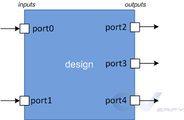

# Verilog 端口

端口是一组信号，它们充当特定模块的输入和输出，并且是与其通信的主要方式。将模块视为放置在 PCB(printed circuit board) 上的制造芯片，很明显，与芯片通信的唯一方法是通过其引脚。端口就像引脚，被设计用来发送和接收来自外部世界的信号。

<p style="text-align:center"></p>

## 端口类型

|端口|描述|
|:-:|:-:|
|输入|设计模块通过它的 `input` 端口只能接受来自外界的信号。|
|输出|设计模块通过它的 `output` 端口只能向外界发送信号。|
|输入输出|设计模块通过它的 `inout` 端口既能够发送信号，也能够接收信号。|

::: tip
没有指定数据类型的端口默认都是 `wire` 类型。
:::

## 语法

声明为 `inout` 的端口既可以作为输入，也可以作为输出。

```verilog
input   [net type] [range] list_of_names;
inout   [net type] [range] list_of_names;
output  [net type] [range] list_of_names;
output  [var type] [range] list_of_names;
```

### 示例

在下面显示的代码中，有三个 `input` 端口，一个 `output` 端口和一个 `inout` 端口。

```verilog
module my_design (  input wire      clk,
                    input           en,
                    input           rw,
                    inout [15:0]    data,
                    output          int);
    
    // Design behavior as Verilog code

endmodule
```

多个端口使用同样的名称是非法的。

```verilog
input aport;    // First declaration - valid
input aport;    // Error - already declared
output aport;   // Error - already declared
```

## 带符号的端口

`signed` 属性可以被绑定到端口、导线或者变量的声明上面，显式地制定这些元素是带符号的。默认情况下是无符号的。

```verilog
module demo (input  a,
                    b,
            output  c);

    // ports a, b, and c are by default unsigned
endmodule
```

端口类型和数据类型可以分开声明（在这一讲的最后还会再提），但是，任何一个声明中用了 `signed` 关键字，那么整个变量在任何地方就都是有符号的了。

```verilog
module demo (input signed a, b,
            output c);
    wire a, b;      // a, b are signed from port declaration
    reg signed c;   // c is signed from reg declaration
endmodule
```

## 端口变化

### Verilog 1995

Verilog经过多次修改，1995年的原始IEEE版本有以下端口声明方式。在这里，模块声明必须首先在括号内列出端口的名称，然后在模块主体中随后定义这些端口的方向。

```verilog
module test (a, b, c);

	input 	[7:0] a;            // inputs "a" and "b" are wires
	input 	[7:0] b;
	output 	[7:0] c; 			// output "c" by default is a wire

	// Still, you can declare them again as wires to avoid confusion
	wire 	[7:0] a;
	wire 	[7:0] b;
	wire 	[7:0] c;
endmodule


module test (a, b, c);

	input  [7:0] a, b;
	output [7:0] c;           // By default c is of type wire

	// port "c" is changed to a reg type
	reg    [7:0] c;
endmodule
```

### Verilog 2001 及以后

ANSI-C 风格的端口命名在 2001 年被引入并且允许在端口表中进行端口类型以及数据类型的指定。

```verilog
module test ( input [7:0]	a,
                            b, 		// "b" is considered an 8-bit input
              output [7:0]  c);

	// Design content
endmodule

module test ( input wire [7:0]	a,
              input wire [7:0]  b,
              output reg [7:0]  c);

	// Design content
endmodule
```

如果端口声明包括导线或变量类型，则认为该端口已完全声明。重新声明相同端口的导线或变量类型是非法的。

```verilog
module test ( input      [7:0] a,       // a, e are implicitly declared of type wire
	          output reg [7:0] e );

   wire signed [7:0] a;     // illegal - declaration of a is already complete -> simulator dependent
   wire        [7:0] e;     // illegal - declaration of e is already complete

   // Rest of the design code
endmodule
```

如果端口声明不包括导线或变量类型，则可以再次声明端口的导线或者变量类型。

```verilog
module test ( input      [7:0] a,
              output     [7:0] e);

     reg [7:0] e;              // Okay - net_type was not declared before

     // Rest of the design code
endmodule
```


