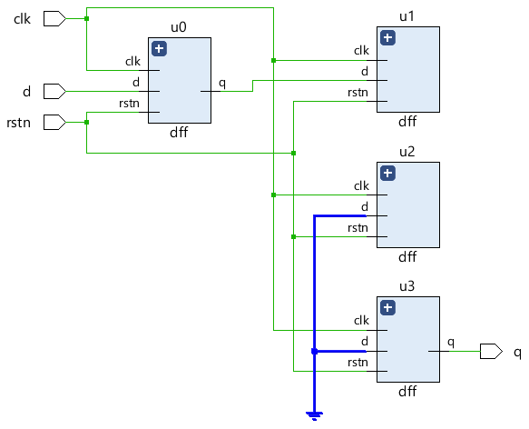
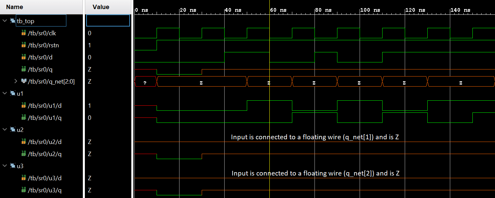

# Verilog 模块实例化

正如我们前面两篇文章中看到的，更大更复杂的设计是通过以分层方式集成多个模块来构建的。模块可以在其他模块中实例化，并且这些实例的端口可以与父模块中的其他信号连接。

这些端口连接可以通过有序列表(ordered list)或名称(name)完成。

## 通过有序列表连接端口

在模块实例化中列出的端口表达式与父模块内的信号之间建立连接的一种方法是通过有序列表。

`mydesign` 是在另一个名为 `tb_top` 的模块中以名称 `d0` 实例化的模块。端口以特定顺序连接，该顺序由该端口在模块声明的端口列表中的位置确定。例如，测试台中的 `b` 连接到设计的 `y` 仅仅是因为两者都位于端口列表中的第二个位置。

```verilog
module mydesign (input x, y, z, // x is at position 1, y at 2, z at 3 and
                output o);      // o is at position 4

endmodule

module tb_top;
    wire [1:0]  a;
    wire        b, c;

    mydesign d0 (a[0], b, a[1], c);
    // a[0] is at position 1 so it is automatically connected to x
    // b is at position 2 so it is automatically connected to y
    // a[1] is at position 3 so it is automatically connected to z
    // c is at position 4, and hence connection is with o

endmodule
```

::: danger 注意
为了正确连接，我们需要知道 `mydesign` 中端口的声明顺序，因为我们是通过顺序的对应来确定自己到底连接的是哪个端口的。
:::

这是非常不方便的，因为如果为模块添加新端口的话，端口的顺序可能会改变，从而所有的实例化代码就要跟着一起变。并且，当设计中的端口数量非常大时，比对端口顺序的时候很容易出错。

## 通过名字连接端口

连接端口的更好方法是使用端口名称显式链接两侧的端口。点 `.` 表示点后面的端口名称属于待实例化的模块。连接到的信号名称在括号 `( )` 中给出。

```verilog
module design_top;
	wire [1:0]  a;
	wire        b, c;

	mydesign d0  ( .x (a[0]),    // signal "x" in mydesign should be connected to "a[0]" in this module (design_top)
	               .y (b),       // signal "y" in mydesign should be connected to "b" in this module (design_top)
	               .z (a[1]),
	               .o (c));
endmodule
```

建议将每个端口连接编码在单独的行中，以便任何编译错误消息都能正确指向发生错误的行号。如果多个端口在同一行的话，编译错误信息只会告诉我们这一行错了，但并不知道具体是哪个端口，相较于前面一种写法，调试起来就更困难了。

因为这些连接是按名称建立的，所以它们出现的顺序无关紧要。在实例化的时候，一个端口只能连接一次。

```verilog
module design_top;
	mydesign d0 ( .x (a[0]),
	              .z (a[1]),     // z at second position is okay because of explicit connection
	              .y (a[1]),
	              .x (b),        // illegal - x is already connected to a[0]
	              .o (c));
endmodule
```

## 未连接的/悬浮的端口

未连接到实例化该模块的父模块中任何线的端口将具有高阻抗值 `z`。

```verilog
module design_top;
	mydesign d0   (              // x is an input and not connected, hence a[0] will be Z
	              .y (a[1]),
	              .z (a[1]),
	              .o ());        // o has valid value in mydesign but since
	                             // it is not connected to "c" in design_top, c will be Z
endmodule
```

### 示例

让我们以我们之前看到的移位寄存器为例，让一些端口不连接。

```verilog
module shift_reg (  input   d,
                    input   clk,
                    input   rstn,
                    output  q);

    wire [2:0] q_net;

    dff u0 (.d(d),        .clk(clk), .rstn(rstn), .q(q_net[0]));
    dff u1 (.d(q_net[0]), .clk(clk), .rstn(rstn), .q()); 						// Output q is left floating
    dff u2 (.d(q_net[1]), .clk(clk), .rstn(rstn), .q()); 						// Output q is left floating
    dff u3 (.d(q_net[2]), .clk(clk), .rstn(rstn), .q(q));
endmodule
```

请注意，实例 `u1` 和 `u2` 的输出在综合后获得的电路原理图中未连接。由于实例 `u2` 和 `u3` 的输入 `d` 现在连接到没有被任何东西驱动的导线，因此它接地。

<p style="text-align:center"></p>

在仿真中，此类未连接的端口将被表示为高阻态 ('hZ)，通常在波形中显示为中间垂直对齐的橙色线。

<p style="text-align:center"></p>

所有端口声明都会被隐式声明为 `wire` ，因此在这种情况下声明端口方向就足够了。但是，需要存储值的输出端口应声明为 `reg` 数据类型，并且可以在 `always` 和 `initial` 程序块中使用。

`input` 或 `inout` 类型的端口不能声明为 `reg` ，因为它们是从外部连续驱动的，不应存储值，而是尽快反映外部信号的变化。连接两个具有不同位宽大小的端口是完全合法的，但是具有较小位宽大小的端口将占上风，而另一个具有较大位宽的端口的剩余位将被忽略。

```verilog
// Case #1 : Inputs are by default implicitly declared as type "wire"
module des0_1	(input wire clk ...); 		// wire need not be specified here
module des0_2 	(input clk, ...); 			// By default clk is of type wire

// Case #2 : Inputs cannot be of type reg
module des1 (input reg clk, ...); 		// Illegal: inputs cannot be of type reg

// Case #3: Take two modules here with varying port widths
module des2 (output [3:0] data, ...);	// A module declaration with 4-bit vector as output
module des3 (input [7:0] data, ...); 	// A module declaration with 8-bit vector as input

module top ( ... );
	wire [7:0] net;
	des2  u0 ( .data(net) ... ); 		// Upper 4-bits of net are undriven
	des3  u1 ( .data(net) ... );
endmodule

// Case #4 : Outputs cannot be connected to reg in parent module
module top_0 ( ... );
	reg [3:0] data_reg;

	des2 ( .data(data) ...); 	// Illegal: data output port is connected to a reg type signal "data_reg"
endmodule
```


