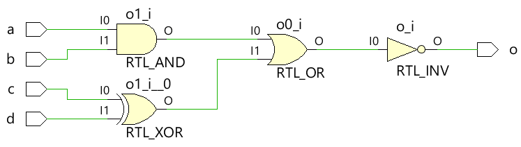

# Verilog assign语句


`wire` 或类似导线的信号数据类型需要连续性的赋值。例如，考虑用于连接电路板上部件的电线。只要将 +5V 电池加到导线的一端，连接到导线另一端的组件就会得到所需的电压。

<p style="text-align:center"></p>

在 Verilog 中，这个概念是通过 `assign` 语句实现的，其中任何 `wire` 或其他类似导线的数据类型都可以用一个值连续驱动。该值可以是常数，也可以是由一组信号组成的表达式。

## Assign 语法

赋值语法以关键字 `assign` 开头，后跟信号名称，信号名称可以是单个信号，也可以是不同信号网络的组合。驱动强度(drive strength)和延迟(delay)是可选的，主要用于数据流建模，而不是综合到真实硬件中。右侧的表达式或信号被评估(evaluate)并分配给左侧的导线或导线表达式。

```verilog
assign <net-expression> = [drive-strength] [delay] <expression of different signals or constant value>
```

延迟值(delay value)可用于指定门的延迟，并用于模拟真实硬件中的时序行为，因为该值指示何时应为导线分配右侧的评估值。

### 规则

使用 `assign` 语句时需要遵循一些规则：

- LHS(left hand side) 应该始终是标量或矢量导线或标量或矢量导线的组合，而不是标量或矢量寄存器。
- RHS(right hand side) 可以包含标量或向量寄存器和函数调用。
- 每当 RHS 上的任何操作数的值发生变化时，LHS 都会用新值更新。
- 分配语句也称为连续分配，并且始终处于活动状态。

### 示例1

在下面的例子中，叫做 `out` 的导线由信号表达式连续驱动。 `i1` 和 `i2` 与逻辑与 `&` 组成表达式。

<p style="text-align:center"></p>

如果将导线换为端口并进行综合，我们将在综合后得到如下图所示的 RTL 示意图。

<p style="text-align:center"></p>

> Verilog 中可以使用连续赋值语句来表示组合门。

### 示例2

下面的模块接受两个输入，并使用 `assign` 语句通过部分选择和多位连接来驱动输出 `z` 。将下面的将每种情况视为模块中的唯一代码，为了掩饰方便，我写在了一起。真正写代码的时候，一个导线只能有一个驱动它的 `assign` 语句，否则同一导线上的许多 `assign` 语句会使这个导线输出变为 `x` 。

```verilog
module xyz (input [3:0] 	x,		// x is a 4-bit vector net
			input 			y, 		// y is a scalar net (1-bit)
			output [4:0] 	z ); 	// z is a 5-bit vector net

wire [1:0] 	a;
wire        b;

// Assume one of the following assignments are chosen in real design
// If x='hC and y='h1 let us see the value of z

// Case #1: 4-bits of x and 1 bit of y is concatenated to get a 5-bit net
// and is assigned to the 5-bit nets of z. So value of z='b11001 or z='h19
assign z = {x, y};

// Case #2: 4-bits of x and 1 bit of y is concatenated to get a 5-bit net
// and is assigned to selected 3-bits of net z. Remaining 2 bits of z remains
// undriven and will be high-imp. So value of z='bZ001Z
assign z[3:1] = {x, y};

// Case #3: The same statement is used but now bit4 of z is driven with a constant
// value of 1. Now z = 'b1001Z because only bit0 remains undriven
assign z[3:1] = {x, y};
assign z[4] = 1;

// Case #4: Assume bit3 is driven instead, but now there are two drivers for bit3,
// and both are driving the same value of 0. So there should be no contention and
// value of z = 'bZ001Z
assign z[3:1] = {x, y};
assign z[3] = 0;

// Case #5: Assume bit3 is instead driven with value 1, so now there are two drivers
// with different values, where the first line is driven with the value of X which
// at the time is 0 and the second assignment where it is driven with value 1, so
// now it becomes unknown which will win. So z='bZX01Z
assign z[3:1] = {x, y};
assign z[3] = 1;

// Case #6: Partial selection of operands on RHS is also possible and say only 2-bits
// are chosen from x, then z = 'b00001 because z[4:3] will be driven with 0
assign z = {x[1:0], y};

// Case #7: Say we explicitly assign only 3-bits of z and leave remaining unconnected
// then z = 'bZZ001
assign z[2:0] = {x[1:0], y};

// Case #8: Same variable can be used multiple times as well and z = 'b00111
// 3{y} is the same as {y, y, y}
assign z = {3{y}};

// Case #9: LHS can also be concatenated: a is 2-bit vector and b is scalar
// RHS is evaluated to 11001 and LHS is 3-bit wide so first 3 bits from LSB of RHS
// will be assigned to LHS. So a = 'b00 and b ='b1
assign {a, b} = {x, y};

// Case #10: If we reverse order on LHS keeping RHS same, we get a = 'b01 and b='b0
assign {a, b} = {x, y};

endmodule
```

## reg 变量的赋值

使用 `assign` 语句驱动或分配 `reg` 类型变量是非法的。这是因为 `reg` 变量能够存储数据，不需要连续驱动。 `reg` 信号只能在像 `initial` 和 `always` 这样的程序块中驱动。

## 隐式连续驱动

当 `assign` 语句用于为给定的导线分配某个值时，称为显式分配(explicit assignment)。 Verilog 还允许在声明导线时进行赋值，称为隐式赋值。

```verilog
wire [1:0] a;
assign a = x & y;   // Explicit assignment

wire [1:0] a = x & y;   // Implicit assignment
```

## 组合逻辑设计

考虑以下由逻辑门和相应的 Verilog 代码组成的数字电路。

<p style="text-align:center"></p>

组合逻辑需要连续驱动输入以保持输出，这与触发器等顺序元件不同，触发器的值在时钟边缘被捕获和存储。因此，`assign` 语句非常适合描述组合逻辑电路，因为只要右侧的任何输入发生变化，输出 `o` 就会更新。

```verilog
// This module takes four inputs and performs a boolean
// operation and assigns output to o. The combinational
// logic is realized using assign statement.

module combo (	input 	a, b, c, d,
				output  o);

    assign o = ~((a & b) | c ^ d);

endmodule
```

### 硬件示意图

在模块综合之后，我们确实看到了一个组合电路，其行为方式与 `assign` 语句建模的方式相同。

<p style="text-align:center"></p>

看到只要 RHS 上的组合表达式为真，信号 `o` 就变为 `1` 。同样，当 RHS 为假时，`o` 变为 `0` 。输出 `o` 从 0ns 到 10ns 是 `x` ，因为此时的输入是 `x`。

<p style="text-align:center"></p>


`