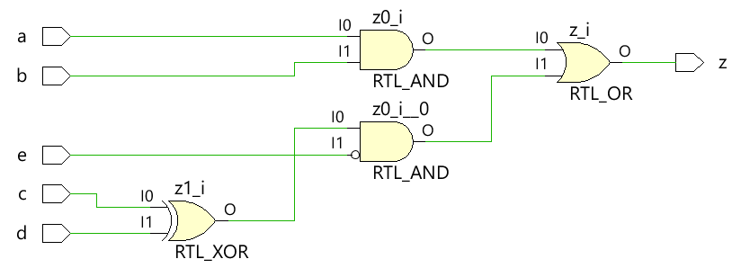
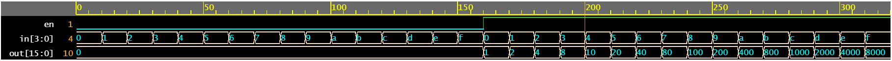

# assign 与组合逻辑

verilog `assign` 语句通常用于连续驱动 `wire` 数据类型的信号并最终被综合成组合逻辑。下面是一些使用 `assign` 语句的设计示例。

## 例1：简单组合逻辑

下面显示的代码实现了一个简单的数字组合逻辑，它有一个输出线 `z`，它通过一个 `assign` 语句连续驱动以实现数字方程。

```verilog
module combo ( 	input 	a, b, c, d, e,
				output 	z);

	assign z = ((a & b) | (c ^ d) & ~e);

endmodule
```

`combo` 模块使用综合工具会生成以下的硬件原理图，可以看出组合逻辑是用数字门实现的。

<p style="text-align:center"></p>

### 测试台

测试台(testbench)是一个用于模拟设计的平台，以确保设计的行为符合预期。使用 `for` 循环将所有的输入组合驱动到设计好的模块中，每次驱动持续10个时间单位。

```verilog
module tb;
	// Declare testbench variables
    reg a, b, c, d, e;
    wire z;
    integer i;

    // Instantiate the design and connect design inputs/outputs with
    // testbench variables
    combo u0 ( .a(a), .b(b), .c(c), .d(d), .e(e), .z(z));

    initial begin
  	    // At the beginning of time, initialize all inputs of the design
  	    // to a known value, in this case we have chosen it to be 0.
        a <= 0;
        b <= 0;
        c <= 0;
        d <= 0;
        e <= 0;

        // Use a $monitor task to print any change in the signal to
        // simulation console
        $monitor ("a=%0b b=%0b c=%0b d=%0b e=%0b z=%0b",
                a, b, c, d, e, z);

        // Because there are 5 inputs, there can be 32 different input combinations
        // So use an iterator "i" to increment from 0 to 32 and assign the value
        // to testbench variables so that it drives the design inputs
        for (i = 0; i < 32; i = i + 1) begin
            {a, b, c, d, e} = i;
            #10;
        end
    end
endmodule
```

仿真日志：

```bash
a=0 b=0 c=0 d=0 e=0 z=0
a=0 b=0 c=0 d=0 e=1 z=0
a=0 b=0 c=0 d=1 e=0 z=1
a=0 b=0 c=0 d=1 e=1 z=0
a=0 b=0 c=1 d=0 e=0 z=1
a=0 b=0 c=1 d=0 e=1 z=0
a=0 b=0 c=1 d=1 e=0 z=0
a=0 b=0 c=1 d=1 e=1 z=0
a=0 b=1 c=0 d=0 e=0 z=0
a=0 b=1 c=0 d=0 e=1 z=0
a=0 b=1 c=0 d=1 e=0 z=1
a=0 b=1 c=0 d=1 e=1 z=0
a=0 b=1 c=1 d=0 e=0 z=1
a=0 b=1 c=1 d=0 e=1 z=0
a=0 b=1 c=1 d=1 e=0 z=0
a=0 b=1 c=1 d=1 e=1 z=0
a=1 b=0 c=0 d=0 e=0 z=0
a=1 b=0 c=0 d=0 e=1 z=0
a=1 b=0 c=0 d=1 e=0 z=1
a=1 b=0 c=0 d=1 e=1 z=0
a=1 b=0 c=1 d=0 e=0 z=1
a=1 b=0 c=1 d=0 e=1 z=0
a=1 b=0 c=1 d=1 e=0 z=0
a=1 b=0 c=1 d=1 e=1 z=0
a=1 b=1 c=0 d=0 e=0 z=1
a=1 b=1 c=0 d=0 e=1 z=1
a=1 b=1 c=0 d=1 e=0 z=1
a=1 b=1 c=0 d=1 e=1 z=1
a=1 b=1 c=1 d=0 e=0 z=1
a=1 b=1 c=1 d=0 e=1 z=1
a=1 b=1 c=1 d=1 e=0 z=1
a=1 b=1 c=1 d=1 e=1 z=1
```

<p style="text-align:center"></p>

## 例2：半加器

半加器(half adder)模块接受两个标量输入 `a` 和 `b` ，并使用组合逻辑来分配输出 `sum` 和进位 `cout` 。和由 `a` 和 `b` 之间的 XOR 驱动，而进位位由两个输入之间的 AND 获得。

```verilog
module ha ( input 	a,   b,
			output	sum, cout);

	assign sum  = a ^ b;
	assign cout = a & b;

endmodule
```

<p style="text-align:center"></p>

### 测试台

```verilog
module tb;
	// Declare testbench variables
    reg a, b;
    wire sum, cout;
    integer i;

    // Instantiate the design and connect design inputs/outputs with
    // testbench variables
    ha u0 ( .a(a), .b(b), .sum(sum), .cout(cout));

    initial begin
        // At the beginning of time, initialize all inputs of the design
        // to a known value, in this case we have chosen it to be 0.
        a <= 0;
        b <= 0;

        // Use a $monitor task to print any change in the signal to
        // simulation console
        $monitor("a=%0b b=%0b sum=%0b cout=%0b", a, b, sum, cout);

        // Because there are only 2 inputs, there can be 4 different input combinations
        // So use an iterator "i" to increment from 0 to 4 and assign the value
        // to testbench variables so that it drives the design inputs
        for (i = 0; i < 4; i = i + 1) begin
            {a, b} = i;
            #10;
        end
    end
endmodule
```

仿真日志：

```bash
a=0 b=0 sum=0 cout=0
a=0 b=1 sum=1 cout=0
a=1 b=0 sum=1 cout=0
a=1 b=1 sum=0 cout=1
```

<p style="text-align:center"></p>

## 例3：全加器

可以使用上面展示的半加器模块构建全加器，或者可以使用分配语句原样应用整个组合逻辑来驱动输出 `sum` 和 `cout`。

```verilog
module fa (	input 	a, b, cin,
			output 	sum, cout);

	assign sum  = (a ^ b) ^ cin;
	assign cout = (a & b) | ((a ^ b) & cin);

endmodule
```

<p style="text-align:center"></p>

### 测试台

```verilog
module tb;
    reg a, b, cin;
    wire sum, cout;
    integer i;

    fa u0 ( .a(a), .b(b), .cin(cin), .sum(sum), .cout(cout));

    initial begin
        a <= 0;
        b <= 0;

        $monitor("a=%0b b=%0b cin=%0b sum=%0b cout=%0b", a, b, cin, sum, cout);

        for (i = 0; i < 7; i = i + 1) begin
            {a, b, cin} = i;
            #10;
        end
    end
endmodule
```

仿真日志：

```bash
a=0 b=0 cin=0 sum=0 cout=0
a=0 b=0 cin=1 sum=1 cout=0
a=0 b=1 cin=0 sum=1 cout=0
a=0 b=1 cin=1 sum=0 cout=1
a=1 b=0 cin=0 sum=1 cout=0
a=1 b=0 cin=1 sum=0 cout=1
a=1 b=1 cin=0 sum=0 cout=1
```

<p style="text-align:center"></p>

## 例4：2x1多路复用器

简单的2x1多路复用器使用三元运算符来决定应将哪个输入分配给输出 `c` 。如果 `sel` 为 `1` ，则输出由 `a` 驱动，如果  `sel` 为 `0` ，则输出由 `b` 驱动。

```verilog
module mux_2x1 (input 	a, b, sel,
				output 	c);

	assign c = sel ? a : b;

endmodule
```

<p style="text-align:center"></p>

### 测试台

```verilog
module tb;
	// Declare testbench variables
    reg a, b, sel;
    wire c;
    integer i;

    // Instantiate the design and connect design inputs/outputs with
    // testbench variables
    mux_2x1 u0 ( .a(a), .b(b), .sel(sel), .c(c));

    initial begin
        // At the beginning of time, initialize all inputs of the design
        // to a known value, in this case we have chosen it to be 0.
        a <= 0;
        b <= 0;
        sel <= 0;

        $monitor("a=%0b b=%0b sel=%0b c=%0b", a, b, sel, c);

        for (i = 0; i < 3; i = i + 1) begin
            {a, b, sel} = i;
            #10;
        end
    end
endmodule
```

仿真日志：

```verilog
a=0 b=0 sel=0 c=0
a=0 b=0 sel=1 c=0
a=0 b=1 sel=0 c=1
```

<p style="text-align:center"></p>

## 例5：1x4解复用器

解复用器使用 `sel` 和 `f` 输入的组合来驱动不同的输出信号。每个输出信号由单独的分配语句驱动。注意，一般不建议同一个信号由不同的 `assign` 语句驱动。

```verilog
module demux_1x4 (	input 			f,
					input [1:0]	 	sel,
					output 			a, b, c, d);

	assign a = f & ~sel[1] & ~sel[0];
	assign b = f &  sel[1] & ~sel[0];
	assign c = f & ~sel[1] &  sel[0];
	assign d = f &  sel[1] &  sel[0];

endmodule
```

<p style="text-align:center"></p>

### 测试台

```verilog
module tb;
	// Declare testbench variables
    reg f;
    reg [1:0] sel;
    wire a, b, c, d;
    integer i;

    // Instantiate the design and connect design inputs/outputs with
    // testbench variables
    demux_1x4 u0 ( .f(f), .sel(sel), .a(a), .b(b), .c(c), .d(d));

    // At the beginning of time, initialize all inputs of the design
    // to a known value, in this case we have chosen it to be 0.
    initial begin
        f <= 0;
        sel <= 0;

        $monitor("f=%0b sel=%0b a=%0b b=%0b c=%0b d=%0b", f, sel, a, b, c, d);

        // Because there are 3 inputs, there can be 8 different input combinations
        // So use an iterator "i" to increment from 0 to 8 and assign the value
        // to testbench variables so that it drives the design inputs
        for (i = 0; i < 8; i = i + 1) begin
            {f, sel} = i;
            #10;
        end
    end
endmodule
```

仿真日志：

```bash
f=0 sel=0 a=0 b=0 c=0 d=0
f=0 sel=1 a=0 b=0 c=0 d=0
f=0 sel=10 a=0 b=0 c=0 d=0
f=0 sel=11 a=0 b=0 c=0 d=0
f=1 sel=0 a=1 b=0 c=0 d=0
f=1 sel=1 a=0 b=0 c=1 d=0
f=1 sel=10 a=0 b=1 c=0 d=0
f=1 sel=11 a=0 b=0 c=0 d=1
```

<p style="text-align:center"></p>

## 例6：4x16解码器

```verilog
module dec_4x16 ( 	input 			en,
					input 	[3:0] 	in,
					output  [15:0] 	out);

	assign out = en ? 1 << in: 0;

endmodule
```

<p style="text-align:center"></p>

### 测试台

```verilog
module tb;
    reg en;
    reg [3:0] in;
    wire [15:0] out;
    integer i;

    dec_4x16 u0 ( .en(en), .in(in), .out(out));

    initial begin
        en <= 0;
        in <= 0;

        $monitor("en=%0b in=0x%0h out=0x%0h", en, in, out);

        for (i = 0; i < 32; i = i + 1) begin
            {en, in} = i;
            #10;
        end
    end
endmodule
```

仿真日志：

```bash
en=0 in=0x0 out=0x0
en=0 in=0x1 out=0x0
en=0 in=0x2 out=0x0
en=0 in=0x3 out=0x0
en=0 in=0x4 out=0x0
en=0 in=0x5 out=0x0
en=0 in=0x6 out=0x0
en=0 in=0x7 out=0x0
en=0 in=0x8 out=0x0
en=0 in=0x9 out=0x0
en=0 in=0xa out=0x0
en=0 in=0xb out=0x0
en=0 in=0xc out=0x0
en=0 in=0xd out=0x0
en=0 in=0xe out=0x0
en=0 in=0xf out=0x0
en=1 in=0x0 out=0x1
en=1 in=0x1 out=0x2
en=1 in=0x2 out=0x4
en=1 in=0x3 out=0x8
en=1 in=0x4 out=0x10
en=1 in=0x5 out=0x20
en=1 in=0x6 out=0x40
en=1 in=0x7 out=0x80
en=1 in=0x8 out=0x100
en=1 in=0x9 out=0x200
en=1 in=0xa out=0x400
en=1 in=0xb out=0x800
en=1 in=0xc out=0x1000
en=1 in=0xd out=0x2000
en=1 in=0xe out=0x4000
en=1 in=0xf out=0x8000
```

<p style="text-align:center"></p>


