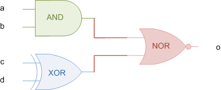
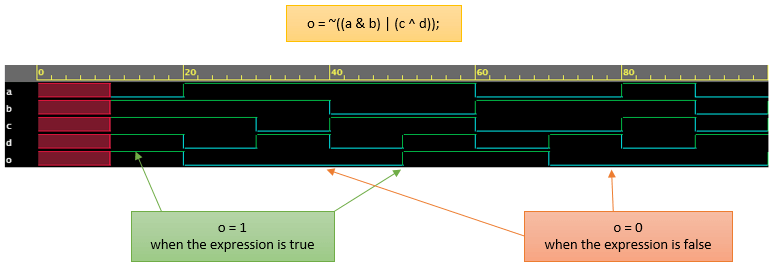

# Verilog always 语句块

`always` 块是 Verilog 中的程序块之一。 always 块中的语句是顺序执行的。

## 语法

```verilog
always @ (event)
	[statement]

always @ (event) begin
	[multiple statements]
end
```

always 块在某些特定事件发生给的时候。事件由敏感度列表(sensitivity list)定义。

## 敏感度列表是什么？

敏感度列表是定义何时应执行 `always` 块的表达式，在 `@` 运算符之后的括号 `( )` 内指定。此列表可能包含一个或一组信号，其值更改将执行 `always` 块。

在下面的代码中，只要信号 `a` 或 `b` 的值发生变化，`always` 块内的语句将会被顺序执行。

```verilog
// Execute always block whenever value of "a" or "b" change
always @ (a or b) begin
	[statements]
end
```

## always 块是用来做什么的？

always 块可用于实现组合(combinational)或时序(sequential)逻辑。当提供时钟和复位时，触发器等时序元件将变为活动状态。类似地，组合块在其输入值之一改变时变为活动状态。这些硬件块都相互独立地同时工作。两者之间的联系决定了数据的流动。为了对这种行为建模，将 `always` 块作为一个连续过程，当敏感度列表中的信号变为活动状态时，该过程被触发并执行某些操作。

在以下示例中，`always` 块中的语句在信号 `clk` 的每个上升沿执行。

```verilog
// Execute always block at positive edge of signal "clk"
always @ (posedge clk) begin
	[statements]
end
```

## 如果没有敏感度列表会怎么样？

`always` 块会在整个模拟过程中不断重复。敏感列表带来了一定的时间感，即每当敏感列表中的任何信号发生变化时，都会触发`always` 块。如果在 `always` 块中没有时序控制语句，仿真将因为零延迟无限循环而挂起！

### 示例

下面显示的示例是一个 `always` 块，它尝试反转信号 `clk` 的值。该语句在每 0 个时间单位后执行。因此，由于语句中没有延迟，它会永远执行。

```verilog
// always block is started at time 0 units
// But when is it supposed to be repeated ?
// There is no time control, and hence it will stay and
// be repeated at 0 time units only. This continues
// in a loop and simulation will hang !
always clk = ~clk;
```

即使敏感列表是空的，也应该有其他形式的时间延迟。如下所示，`always` 结构中的延迟语句会模拟时间的前进。现在，每 `10` 个时间单位进行一次时钟反转。

```verilog
always #10 clk = ~clk;
```

::: warning 注意
显式延迟不能综合成逻辑门，这种写法只能用于模拟，无法被实现成硬件。
:::

因此，真正的 Verilog 设计代码的 `always` 语句块总是需要一个敏感度列表的。

## 时序逻辑元件设计示例

下面的代码定义了一个叫做 `tff` 的模块，它接受数据输入、时钟和低电平有效复位。只要在时钟的上升沿发现 `d` 为 `1`，输出就会反转。这里， `always` 块在 `clk` 的上升沿或 `rstn` 的下降沿触发。

### 在时钟上升沿的时候会发生什么？

以下事件发生在时钟的上升沿，并在所有时钟上升沿重复执行。

1. 首先 `if` 块检查低电平有效复位 `rstn` 的值
    1. 如果 `rstn` 为 0，则输出 `q` 应重置为默认值 0；
    2. 如果 `rstn` 为 1，则表示未进行重置，应遵循默认行为。
2. 如果上一步为假：
    1. 检查 `d` 的值，如果发现为 1，则反转 `q` 的值；
    2. 如果 `d` 为 0，则保持 `q` 的值。

```verilog
module tff (input  		d,
						clk,
						rstn,
			output reg 	q);

	always @ (posedge clk or negedge rstn) begin
		if (!rstn)
			q <= 0;
		else
			if (d)
				q <= ~q;
			else
				q <= q;
	end
endmodule
```

### 在复位的下降沿会发生什么？

以下事件发生在 `rstn` 的下降沿，并在所有的下降沿都会发生。

1. 首先 `if` 块检查低电平有效复位 `rstn` 的值。在信号的下降沿，其值为 0。
    1. 如果 `rstn` 的值为 0，则表示应用了复位，输出应复位为默认值 0
    2. 不考虑 `rstn` 的值为 1 的情况，因为当前事件是 `rstn` 的下降沿

## 组合逻辑元件设计示例

`always` 块也可用于组合逻辑的设计。例如，下面的数字电路表示三个不同逻辑门的组合，它们在信号 `o` 处提供特定输出。

<p style="text-align:center"></p>

下面的代码是一个具有四个输入端口和一个叫做 `o` 的单个输出端口的模块。只要敏感度列表中的任何信号值发生变化，就会触发 `always` 块。输出信号在模块端口列表中被声明为 `reg` 类型，因为它在程序块中被修改。程序块中修改的所有信号都应声明为 `reg` 类型。

看到只要 RHS 上的组合表达式为真，信号 `o` 就变为 1。同样，当 RHS 为假时，`o` 变为 0。

仿真输出：

<p style="text-align:center"></p>


