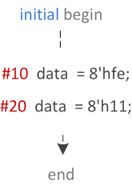
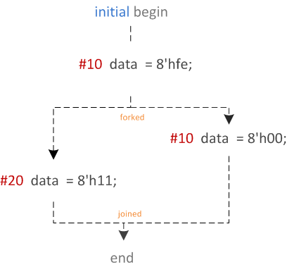
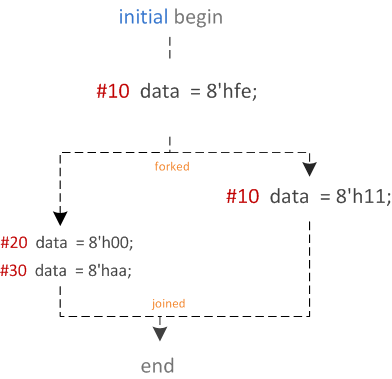

# Verilog 块语句

有一些方法可以将一组语句组合在一起，这些语句在语法上等同于单个语句，称为块语句(block statements)。有两种块语句：顺序(sequential)和并行(parallel)。

## 顺序

语句使用 `begin` 和 `end` 关键字包装，并将按照给定的顺序依次执行，一个接一个。延迟值是相对于前一条语句的执行时间来处理的。在执行完块内的所有语句后，控制权可能会传递到其他地方。

<p style="text-align:center"></p>

```verilog
module design0;
	bit [31:0] data;

	// "initial" block starts at time 0
	initial begin

		// After 10 time units, data becomes 0xfe
		#10   data = 8'hfe;
		$display ("[Time=%0t] data=0x%0h", $time, data);

		// After 20 time units, data becomes 0x11
		#20   data = 8'h11;
		$display ("[Time=%0t] data=0x%0h", $time, data);
	end
endmodule
```

在上面的示例中， `begin-end` 块中的第一条语句将在第 10 个单位时间执行。第二条语句将在第 30 个单位时间执行，这是因为延迟是相对的，上一条语句执行后的 20 个单位时间就是第 30 个单位时间。

仿真日志：

```bash
[Time=10] data=0xfe
[Time=30] data=0x11
```

## 并行

并行块可以同时执行语句，并且可以使用延迟控制来提供时序关系。通过将它们包装在 `fork` 和 `join` 关键字中来并行启动。

```verilog
initial begin
	#10   data = 8'hfe;
	fork
	   #20 data = 8'h11;
	   #10 data = 8'h00;
	join
end
```

<p style="text-align:center"></p>

在上面的示例中， `fork-join` 块将在第 10 个单位时间的启动。该块中的语句将并行执行，并且将启动的第一个语句将是数据被分配值 `8'h00` 的语句，因为延迟是在启动 `fork-join` 后 10 个时间单位。再过 10 个时间单位后，将启动第一条语句，数据将获得值 `8'h11`。

```verilog
initial begin
	#10 data = 8'hfe;
	fork
		#10 data = 8'h11;
		begin
			#20 data = 8'h00;
			#30 data = 8'haa;
		end
	join
end
```

<p style="text-align:center"></p>

上例中有一个 `begin-end` 块， `begin-end` 块中的所有语句都会按顺序执行，但块本身会与其他语句一起并行启动。因此，数据将在 20 个时间单位获得 `8'h11`，在 30 个时间单位获得 `8'h00`，在 60 个时间单位获得 `8'haa`。

## 块的命名

顺序块和并行块都可以通过在关键字 `begin` 和 `fork` 之后添加： `name_of_block` 来命名。通过这样做，可以在 `disable` 语句中引用该块。

```verilog
begin : name_seq
	[statements]
end

fork : name_fork
	[statements]
join
```

