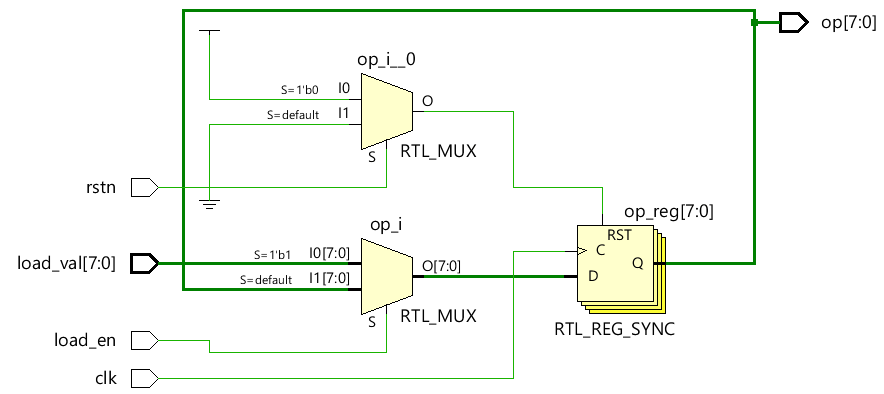

# Verilog for循环

`for` 循环是软件中使用最广泛的循环，但它主要用于在 Verilog 中复制硬件逻辑。 `for` 循环背后的想法是迭代循环中给定的一组语句，只要给定条件为真。这与 `while` 循环非常相似，但更多地用于迭代器可用且条件取决于此迭代器的值的上下文中。

## 语法

```verilog
for (<initial_condition>; <condition>; <step_assignment>) begin
	// Statements
end
```

关键字 for 用于指定这种类型的循环，分为三个部分：

- 指定信号初始值的初始条件；
- 检查以评估(evaluate)给定条件是否为真；
- 为下一次迭代更新控制变量。

初始条件和控制变量的更新包含在 `for` 循环中，不需要像 `while` 循环那样单独指定。 `while` 循环更通用，只要给定条件成立，就需要重复给定语句时，我们就能使用 `while` 循环。然而，`for` 循环通常有一个明确的开始和结束，由某个循环变量控制。

这是一个简单的示例，说明了 `for` 循环的用法。

```verilog
module my_design;
	integer i;

	initial begin
		// Note that ++ operator does not exist in Verilog !
		for (i = 0; i < 10; i = i + 1) begin
			$display ("Current loop#%0d ", i);
		end
	end
endmodule
```

仿真日志：

```bash
Current loop#0 
Current loop#1 
Current loop#2 
Current loop#3 
Current loop#4 
Current loop#5 
Current loop#6 
Current loop#7 
Current loop#8 
Current loop#9
```

## 设计示例

让我们看看如何在没有 `for` 循环的情况下在 Verilog 中实现 8 位左移寄存器，然后将其与使用 `for` 循环的代码进行比较，以了解循环结构的实用性。

```verilog
module lshift_reg (input 				clk,		// Clock input
                   input 				rstn,		// Active low reset input
                   input [7:0] 			load_val, 	// Load value
                   input 				load_en, 	// Load enable
                   output reg [7:0]     op); 		// Output register value

    // At posedge of clock, if reset is low set output to 0
    // If reset is high, load new value to op if load_en=1
    // If reset is high, and load_en=0 shift register to left
    always @ (posedge clk) begin
        if (!rstn) begin
        op <= 0;
        end else begin
            if (load_en) begin
            op <= load_val;
        end else begin
            op[0] <= op[7];
            op[1] <= op[0];
            op[2] <= op[1];
            op[3] <= op[2];
            op[4] <= op[3];
            op[5] <= op[4];
            op[6] <= op[5];
            op[7] <= op[6];
        end
        end
    end
endmodule
```

可以使用 `for` 循环实现相同的行为，这将减少代码并使其可针对不同的寄存器宽度进行扩展。如果将寄存器的宽度设为 Verilog 参数，则设计模块将变得可伸缩(scalable)，并且可以在 `for` 循环内使用相同的参数。

```verilog
module lshift_reg (input 				clk,		// Clock input
                   input    			rstn,		// Active low reset input
                   input [7:0] 			load_val, 	// Load value
                   input 				load_en, 	// Load enable
                   output reg [7:0]     op); 		// Output register value

    integer i;

    // At posedge of clock, if reset is low set output to 0
    // If reset is high, load new value to op if load_en=1
    // If reset is high, and load_en=0 shift register to left
    always @ (posedge clk) begin
        if (!rstn) begin
            op <= 0;
        end else begin
            // If load_en is 1, load the value to op
            // else keep shifting for every clock
            if (load_en) begin
                op <= load_val;
            end else begin
                for (i = 0; i < 8; i = i + 1) begin
                    op[i + 1] <= op[i];
                end
                op[0] <= op[7];
            end
        end
    end
endmodule
```

### 测试台

测试台代码如下所示并实例化设计。

```verilog
module tb;
    reg clk;
    reg rstn;
    reg [7:0] load_val;
    reg load_en;
    wire [7:0] op;

    // Setup DUT clock
    always #10 clk = ~clk;

    // Instantiate the design
    lshift_reg u0 ( .clk(clk),
                    .rstn (rstn),
                    .load_val (load_val),
                    .load_en (load_en),
                    .op (op));

    initial begin
        // 1. Initialize testbench variables
        clk <= 0;
        rstn <= 0;
        load_val <= 8'h01;
        load_en <= 0;

        // 2. Apply reset to the design
        repeat (2) @ (posedge clk);
        rstn <= 1;
        repeat (5) @ (posedge clk);

        // 3. Set load_en for 1 clk so that load_val is loaded
        load_en <= 1;
        repeat(1) @ (posedge clk);
        load_en <= 0;

        // 4. Let design run for 20 clocks and then finish
        repeat (20) @ (posedge clk);
        $finish;
    end
endmodule
```

<p style="text-align:center"></p>

<p style="text-align:center"></p>


