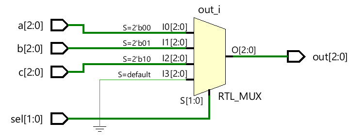

# Verilog case语句

`case` 语句检查给定表达式是否与列表中的其他表达式之一匹配并执行相应的分支语句。它通常用于实现多路复用器。如果有许多条件要检查，则 `if-else` 结构可能不适合，因为那可能综合到优先级编码器而不是多路复用器中，

## 语法

Verilog `case` 语句以 `case` 关键字开始，以 `endcase` 关键字结束。括号内的表达式将只计算一次，并按照它们的编写顺序与备选列表进行比较，并执行备选与给定表达式匹配的语句。一个包含多个语句的块必须分组并位于 `begin` 和 `end` 内。

```verilog
// Here 'expression' should match one of the items (item 1,2,3 or 4)
case (<expression>)
	case_item1 : 	<single statement>
	case_item2,
	case_item3 : 	<single statement>
	case_item4 : 	begin
	          			<multiple statements>
	        			end
	default    : <statement>
endcase
```


如果没有任何 `case` 项与给定表达式匹配，则执行默认项中的语句。 `default` 语句是可选的，一个 `case` 语句中只能有一个 `default` 语句。 Case 语句可以嵌套。

如果没有任何项目与表达式匹配并且没有给出默认语句，则执行将退出 `case` 块而不做任何事情。

## 示例

下图所示的设计模块有一个 2 位选择信号，用于将其他三个 3 位输入之一路由到调用的输出信号。 `case` 语句用于根据 `sel` 的值将正确的输入分配给输出。由于 `sel` 是一个 2 位信号，它可以有 $2^2$ 种组合，从 0 到 3。如果 `sel` 为 3，默认语句会将输出设置为 0。

```verilog
module my_mux (input       [2:0] 	a, b, c, 	// Three 3-bit inputs
                           [1:0]	sel, 	    // 2-bit select signal to choose from a, b, c
               output reg  [2:0] 	out); 		// Output 3-bit signal

    // This always block is executed whenever a, b, c or sel changes in value
    always @ (a, b, c, sel) begin
        case(sel)
            2'b00    : out = a; 		// If sel=0, output is a
            2'b01    : out = b; 		// If sel=1, output is b
            2'b10    : out = c; 		// If sel=2, output is c
            default  : out = 0; 		// If sel is anything else, out is always 0
        endcase
    end
endmodule
```

### 硬件原理图

对 `rtl` 代码进行综合，会获得代表 4 对 1 多路复用器的硬件原理图。

<p style="text-align:center"></p>

看到当 `sel` 为 `3` 时输出为零，并且对于其他值的，将对应输入赋给输出。

仿真日志：

```verilog
[0]  a=0x4 b=0x1 c=0x1 sel=0b11 out=0x0
[10] a=0x5 b=0x5 c=0x5 sel=0b10 out=0x5
[20] a=0x1 b=0x5 c=0x6 sel=0b01 out=0x5
[30] a=0x5 b=0x4 c=0x1 sel=0b10 out=0x1
[40] a=0x5 b=0x2 c=0x5 sel=0b11 out=0x0
```

在 `case` 语句中，只有当表达式的每一位都与包括 0、1、x 和 z 在内的选项之一匹配时，比较才会成功。在上面显示的示例中，如果 `sel` 中的任何位是 x 或 z，则将执行默认语句，因为没有其他替代项匹配。在这种情况下，输出将全为零。

仿真日志：

```verilog
[0] a=0x4 b=0x1 c=0x1 sel=0bxx out=0x0
[10] a=0x3 b=0x5 c=0x5 sel=0bzx out=0x0
[20] a=0x5 b=0x2 c=0x1 sel=0bxx out=0x0
[30] a=0x5 b=0x6 c=0x5 sel=0bzx out=0x0
[40] a=0x5 b=0x4 c=0x1 sel=0bxz out=0x0
[50] a=0x6 b=0x5 c=0x2 sel=0bxz out=0x0
[60] a=0x5 b=0x7 c=0x2 sel=0bzx out=0x0
[70] a=0x7 b=0x2 c=0x6 sel=0bzz out=0x0
[80] a=0x0 b=0x5 c=0x4 sel=0bxx out=0x0
[90] a=0x5 b=0x5 c=0x5 sel=0bxz out=0x0
```

如果设计中的案例陈述在案例项目备选方案中具有 x 和 z，则结果将完全不同。

```verilog
module my_mux ( input  		[2:0] 	a, b, c,
							[1:0]	sel,
				output reg	[2:0] 	out);

    // Case items have x and z and sel has to match the exact value for
    // output to be assigned with the corresponding input
    always @ (a, b, c, sel) begin
        case(sel)
            2'bxz:      out = a;
            2'bzx:      out = b;
            2'bxx:      out = c;
            default:    out = 0;
        endcase
    end
endmodule
```

### 仿真日志

```bash
[0] a=0x4 b=0x1 c=0x1 sel=0bxx out=0x1
[10] a=0x3 b=0x5 c=0x5 sel=0bzx out=0x5
[20] a=0x5 b=0x2 c=0x1 sel=0bxx out=0x1
[30] a=0x5 b=0x6 c=0x5 sel=0bzx out=0x6
[40] a=0x5 b=0x4 c=0x1 sel=0bxz out=0x5
[50] a=0x6 b=0x5 c=0x2 sel=0bxz out=0x6
[60] a=0x5 b=0x7 c=0x2 sel=0bzx out=0x7
[70] a=0x7 b=0x2 c=0x6 sel=0bzz out=0x0
[80] a=0x0 b=0x5 c=0x4 sel=0bxx out=0x4
[90] a=0x5 b=0x5 c=0x5 sel=0bxz out=0x5
```

## case 语句和 if-else 有什么区别？

case 语句在两个方面与 if-else-if 不同：

- if-else 块中给出的表达式更通用，而在 case 块中，单个表达式与多个项目匹配
- 当表达式中有 X 和 Z 值时，case 将提供确定的结果

