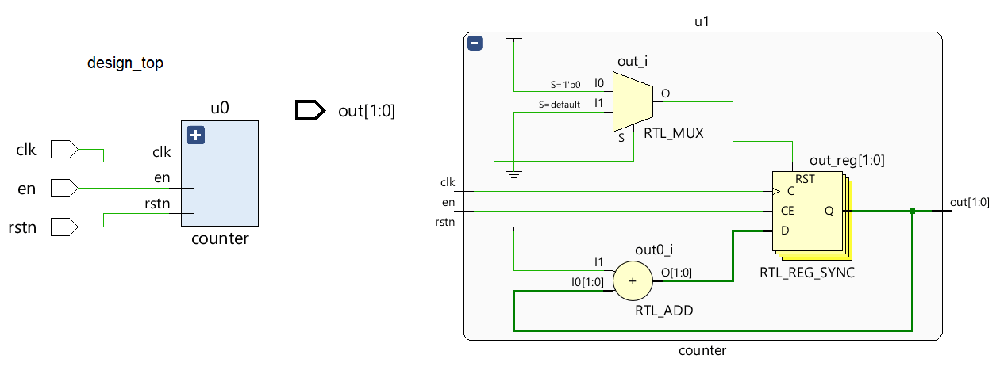
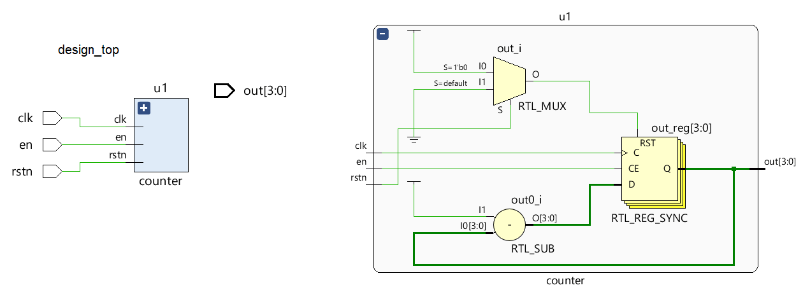

# Verilog 参数

参数是允许以不同的规约复用模块的 Verilog 结构。例如，可以对 4 位加法器进行参数化以接受位数的值，并且可以在模块实例化期间传入新的参数值。因此，N 位加法器可以变成 4 位、8 位或 16 位加法器。它们就像在函数调用期间传入的函数的参数。

```verilog
parameter MSB = 7;                  // MSB is a parameter with a constant value 7
parameter REAL = 4.5;               // REAL holds a real number

parameter FIFO_DEPTH = 256,
          MAX_WIDTH = 32;           // Declares two parameters

parameter [7:0] f_const = 2'b3;     // 2 bit value is converted to 8 bits; 8'b3
```

参数基本上是常量，因此在运行时修改它们的值是非法的。重新声明已经被导线、变量或其他参数使用的名称是非法的。

有两种主要类型的参数，`module` 和 `specify` ，它们都接受范围规范。但是，它们通常与要存储的值一样宽，因此范围规范并不是必要的。

## module 参数

模块参数可用于覆盖模块内的参数定义，这使得模块在编译时具有不同的参数集。可以使用 `defparam` 语句或在模块实例语句中修改参数。通常会在参数名称中使用大写字母以使其立即引人注目。

下面的模块使用参数来指定设计中的总线宽度、数据宽度和 FIFO 深度，并且可以在实例化模块时或使用 `defparam` 语句用新值覆盖。

```verilog
// Verilog 1995 style port declaration
module design_ip  ( addr,
                    wdata,
                    write,
                    sel,
                    rdata);

     parameter  BUS_WIDTH    = 32,
                DATA_WIDTH   = 64,
                FIFO_DEPTH   = 512;

     input addr;
     input wdata;
     input write;
     input sel;
     output rdata;

     wire [BUS_WIDTH-1:0] addr;
     wire [DATA_WIDTH-1:0] wdata;
     reg  [DATA_WIDTH-1:0] rdata;

     reg [7:0] fifo [FIFO_DEPTH];

     // Design code goes here ...
endmodule
```

在新的 ANSI 风格的 Verilog 端口声明中，您可以声明如下所示的参数。

```verilog
module design_ip
	#(parameter BUS_WIDTH=32,
		parameter DATA_WIDTH=64) (

		input [BUS_WIDTH-1:0] addr,
   	// Other port declarations
   );
```

## 覆盖参数

在模块实例化期间，参数可以被新值覆盖(override)。第一部分以名称 `d0` 实例化名为 `design_ip` 的模块，其中新参数在 `#( )` 中传入。第二部分使用 `defparam` 语句来设置新的参数值。第一种方法是在 RTL 设计中传递新参数的最常用方法。第二种方法通常用于测试台仿真，以快速更新设计参数，而无需重新实例化模块。

```verilog
module tb;

    // Module instantiation override
    design_ip  #(BUS_WIDTH = 64, DATA_WIDTH = 128) d0 ( [port list]);

    // Use of defparam to override
    defparam d0.FIFO_DEPTH = 128;

endmodule
```

## 示例

`counter` 模块有两个参数 `N` 和 `DOWN` 分别声明为默认值 2 和 0。 `N` 控制输出中的位数，从而有效地控制计数器的宽度。默认情况下，它是一个 `2` 位计数器。参数 DOWN 控制计数器是递增还是递减。默认情况下，计数器将递增，因为该参数设置为 0。

### 2比特向上计数器

```verilog
module counter
    #( 	parameter N = 2,
   		parameter DOWN = 0)

    (   input 				clk,
        input 				rstn,
        input 				en,
        output 	reg [N-1:0] out);

    always @ (posedge clk) begin
        if (!rstn) begin
        out <= 0;
        end else begin
        if (en)
            if (DOWN)
                out <= out - 1;
            else
                out <= out + 1;
        else
            out <= out;
        end
    end
endmodule
```

模块计数器用 `N` 为 2 实例化，即使它不是必需的，因为默认值无论如何都是 2。在模块实例化期间不会传入 `DOWN` ，因此采用默认值 0 使其成为向上计数器。

```verilog
module design_top ( input        clk,
                    input        rstn,
                    input        en,
                    output [1:0] out);

    counter #(.N(2)) u0 ( .clk(clk),
                          .rstn(rstn),
                          .en(en));
endmodule
```

上面的计数器相当于使用默认参数实现的，其中 `N` 等于 2，使其成为 `2` 位计数器，DOWN 等于 0，使其成为向上计数器。计数器的输出在顶层保持未连接。

<p style="text-align:center"></p>

### 4比特向下计数器

在这种情况下，模块计数器用 `N` 为 4 实例化，使其成为 4 位计数器。 `DOWN` 在模块实例化期间传递了一个值 1，因此实现了一个向下计数器。

```verilog
module design_top (    input clk,
                input rstn,
                input en,
                output [3:0] out);

    counter #(.N(4), .DOWN(1))
    		u1 (.clk(clk),
                .rstn(rstn),
                .en(en));
endmodule
```

<p style="text-align:center"></p>

## specify 参数

这些参数主要用于提供时间和延迟值，并使用 `specparam` 关键字声明。允许在 `specify` 块和主模块体中使用。

```verilog
// Use of specify block
specify
	specparam  t_rise = 200, t_fall = 150;
	specparam  clk_to_q = 70, d_to_q = 100;
endspecify

// Within main module
module  my_block ( ... );
 	specparam  dhold = 2.0;
 	specparam  ddly  = 1.5;

 	parameter  WIDTH = 32;
endmodule
```

## specify 参数和 module 参数的区别

| `specify` 参数| `module` 参数 |
|-|-|
|通过 `specparam` 声明|通过 `parameter` 声明|
|可以在 `specify` 块或者主模块中定义|只能在主模块中定义|
|可以被赋予 `specparam` 或者 `parameter`| 不能被赋予 `specparam` |
|SDF可以被用来覆盖参数值|实例化参数或者 `defparam` 可以被用来覆盖值|

> SDF = Standard Delay File


