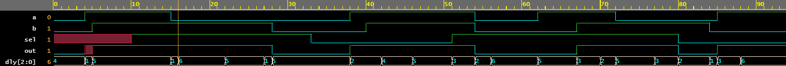
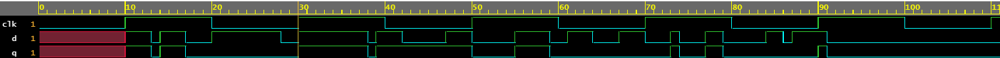
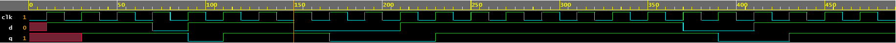

# Verilog 用户自定义原语

像 `nand` 和 `not` 这样的标准 Verilog 原语可能并不总是容易或足以表示复杂的逻辑。可以定义称为 UDP(user defined primitives 用户自定义原语) 的新原语元素来模拟组合或顺序逻辑。

所有 UDP 都只有一个输出，可以是 0、1 或 X，而不是 Z（不支持）。任何具有值 Z 的输入都将被视为 X。

## Verilog UDP 符号

Verilog 用户定义的原语可以写在与模块定义相同的级别，但不能在 `module` 和 `endmodule` 之间。它们可以有多个输入端口，但始终只有一个输出端口，双向端口无效。所有端口信号都必须是标量，这意味着它们必须是 1 位宽。

硬件行为被描述为一个原始状态表，它在 `table` 和 `endtable` 之间列出了输入的不同可能组合以及它们的相应输出。输入和输出信号的值使用以下符号表示。

|Symbol|Comments|
|-|-|
|`0`|逻辑 0|
|`1`|逻辑 1|
|`x`|未知，可以是逻辑 0 或 1。 可以用作输入、输出或者时序UDP的当前状态|
|`?`|逻辑 0, 1 或 x，不可以是UDP的输出|
|`-`|不发生变化，只可以是UDP的输出|
|`ab`|从 `a` 变成 `b` ，其中 `a` `b` 可以是 0 , 1 , x|
|`*` |等价于 `??`, 表示输入值的任意变化|
|`r` |等价于 `01` ，输入的上升沿|
|`f` |等价于 `10` ，输入的下降沿|
|`p` |输入可能的上升沿：0->1, 0->x, 或者 x->1|
|`n` |输入可能的下降沿：1->0, x->0, 或者 1->x|

## 组合逻辑 UDP 示例

```verilog
// Output should always be the first signal in port list
primitive mux (out, sel, a, b);
	output 	out;
	input 	sel, a, b;

	table
		// sel 	a 	b 		out
			0 	1 	? 	: 	1;
			0 	0 	? 	: 	0;
			1 	? 	0 	: 	0;
			1 	? 	1 	: 	1;
			x 	0 	0 	: 	0;
			x 	1 	1 	: 	1;
	endtable
endprimitive
```

一个 ？表示信号可以是 0、1 或 x，在决定最终输出时无关紧要。

下面显示的是一个测试平台模块，它实例化 UDP 并向其应用输入刺激。

```verilog
module tb;
    reg 	  sel, a, b;
    reg [2:0] dly;
    wire 	  out;
    integer   i;

    // Instantiate the UDP - note that UDPs cannot
    // be instantiated with port name connection
    mux u_mux ( out, sel, a, b);

    initial begin
        a <= 0;
        b <= 0;

        $monitor("[T=%0t] a=%0b b=%0b sel=%0b out=%0b", $time, a, b, sel, out);

        // Drive a, b, and sel after different random delays
        for (i = 0; i < 10; i = i + 1) begin
            dly = $random;
            #(dly) a <= $random;
            dly = $random;
            #(dly) b <= $random;
            dly = $random;
            #(dly) sel <= $random;
        end
    end
endmodule
```

仿真日志：

```bash
[T=0] a=0 b=0 sel=x out=0
[T=4] a=1 b=0 sel=x out=x
[T=5] a=1 b=1 sel=x out=1
[T=10] a=1 b=1 sel=1 out=1
[T=15] a=0 b=1 sel=1 out=1
[T=28] a=0 b=0 sel=1 out=0
[T=33] a=0 b=0 sel=0 out=0
[T=38] a=1 b=0 sel=0 out=1
[T=40] a=1 b=1 sel=0 out=1
[T=51] a=1 b=1 sel=1 out=1
[T=54] a=0 b=0 sel=1 out=0
[T=62] a=1 b=0 sel=1 out=0
[T=67] a=1 b=1 sel=1 out=1
[T=72] a=0 b=1 sel=1 out=1
[T=80] a=0 b=1 sel=0 out=0
[T=84] a=0 b=0 sel=0 out=0
[T=85] a=1 b=0 sel=0 out=1
```

<p style="text-align:center"></p>

## 时序逻辑 UDP 示例

顺序逻辑可以是电平敏感或边沿敏感，因此有两种顺序 UDP。输出端口也应该在 UDP 定义中声明为 `reg` 类型，并且可以选择在 `initial` 语句中初始化。

顺序 UDP 在输入和输出字段之间有一个附加字段，由 `:` 分隔，表示当前状态。

### 电平敏感的 UDP

```verilog
primitive d_latch (q, clk, d);
	output 	q;
	input 	clk, d;
	reg  	q;

	table
		// clk 	d 		q 	q+
			1 	1 	:	? :	1;
			1 	0 	: 	? : 0;
			0 	? 	: 	? : -;
	endtable
endprimitive
```

在上表中，表最后一行的连字符 `-` 表示 `q+` 的值没有变化。

```verilog
module tb;
    reg clk, d;
    reg [1:0] dly;
    wire q;
    integer i;

    d_latch u_latch (q, clk, d);

    always #10 clk = ~clk;

    initial begin
        clk = 0;

        $monitor ("[T=%0t] clk=%0b d=%0b q=%0b", $time, clk, d, q);

        #10;  // To see the effect of X

        for (i = 0; i < 50; i = i+1) begin
            dly = $random;
            #(dly) d <= $random;
        end

        #20 $finish;
    end
endmodule
```

<p style="text-align:center"></p>

仿真日志：

```bash
[T=0] clk=0 d=x q=x
[T=10] clk=1 d=1 q=1
[T=13] clk=1 d=0 q=0
[T=14] clk=1 d=1 q=1
[T=17] clk=1 d=0 q=0
[T=20] clk=0 d=1 q=0
[T=28] clk=0 d=0 q=0
[T=30] clk=1 d=1 q=1
[T=38] clk=1 d=0 q=0
[T=39] clk=1 d=1 q=1
[T=40] clk=0 d=1 q=1
[T=42] clk=0 d=0 q=1
[T=47] clk=0 d=1 q=1
[T=50] clk=1 d=0 q=0
[T=55] clk=1 d=1 q=1
[T=59] clk=1 d=0 q=0
[T=60] clk=0 d=0 q=0
[T=61] clk=0 d=1 q=0
[T=64] clk=0 d=0 q=0
[T=67] clk=0 d=1 q=0
[T=70] clk=1 d=0 q=0
[T=73] clk=1 d=1 q=1
[T=74] clk=1 d=0 q=0
[T=77] clk=1 d=1 q=1
[T=79] clk=1 d=0 q=0
[T=80] clk=0 d=0 q=0
[T=84] clk=0 d=1 q=0
[T=86] clk=0 d=0 q=0
[T=87] clk=0 d=1 q=0
[T=90] clk=1 d=1 q=1
[T=91] clk=1 d=0 q=0
[T=100] clk=0 d=0 q=0
[T=110] clk=1 d=0 q=0
```

### 边沿敏感的UDP

在下面显示的示例中，D 触发器被建模为 Verilog 用户定义的原语。注意时钟的上升沿由 `01` 或 `0?` 指定。

```verilog
primitive d_flop (q, clk, d);
	output  q;
	input 	clk, d;
	reg 	q;

	table
		// clk 		d 	 	q 		q+
        // obtain output on rising edge of clk
        (01)	0 	: 	? 	: 	0;
        (01) 	1 	: 	? 	: 	1;
        (0?) 	1 	: 	1 	: 	1;
        (0?) 	0 	: 	0 	: 	0;

        // ignore negative edge of clk
        (?0) 	? 	: 	? 	: 	-;

        // ignore data changes on steady clk
        ? 		(??): 	? 	: 	-;
	endtable
endprimitive
```

在测试台中，UDP 被实例化，并在随机时钟数之后使用随机 `d` 输入值驱动。

```verilog
module tb;
    reg clk, d;
    reg [1:0] dly;
    wire q;
    integer i;

    d_flop u_flop (q, clk, d);

    always #10 clk = ~clk;

    initial begin
        clk = 0;

        $monitor ("[T=%0t] clk=%0b d=%0b q=%0b", $time, clk, d, q);

        #10;  // To see the effect of X

        for (i = 0; i < 20; i = i+1) begin
        dly = $random;
        repeat(dly) @(posedge clk);
        d <= $random;
        end

        #20 $finish;
    end
endmodule
```

从图中可以看出，输出 `q` 在 1 个时钟延迟后变成输入 `d` ，这是 D 触发器所需的行为。

<p style="text-align:center"></p>

仿真日志：

```bash
[T=0] clk=0 d=x q=x
[T=10] clk=1 d=1 q=x
[T=20] clk=0 d=1 q=x
[T=30] clk=1 d=1 q=1
[T=40] clk=0 d=1 q=1
[T=50] clk=1 d=1 q=1
[T=60] clk=0 d=1 q=1
[T=70] clk=1 d=0 q=1
[T=80] clk=0 d=0 q=1
[T=90] clk=1 d=1 q=0
[T=100] clk=0 d=1 q=0
[T=110] clk=1 d=1 q=1
[T=120] clk=0 d=1 q=1
[T=130] clk=1 d=1 q=1
[T=140] clk=0 d=1 q=1
[T=150] clk=1 d=0 q=1
[T=160] clk=0 d=0 q=1
[T=170] clk=1 d=0 q=0
[T=180] clk=0 d=0 q=0
[T=190] clk=1 d=0 q=0
[T=200] clk=0 d=0 q=0
[T=210] clk=1 d=1 q=0
[T=220] clk=0 d=1 q=0
[T=230] clk=1 d=1 q=1
[T=240] clk=0 d=1 q=1
[T=250] clk=1 d=1 q=1
[T=260] clk=0 d=1 q=1
[T=270] clk=1 d=1 q=1
[T=280] clk=0 d=1 q=1
[T=290] clk=1 d=1 q=1
[T=300] clk=0 d=1 q=1
[T=310] clk=1 d=1 q=1
[T=320] clk=0 d=1 q=1
[T=330] clk=1 d=1 q=1
[T=340] clk=0 d=1 q=1
[T=350] clk=1 d=1 q=1
[T=360] clk=0 d=1 q=1
[T=370] clk=1 d=0 q=1
[T=380] clk=0 d=0 q=1
[T=390] clk=1 d=0 q=0
[T=400] clk=0 d=0 q=0
[T=410] clk=1 d=1 q=0
[T=420] clk=0 d=1 q=0
[T=430] clk=1 d=1 q=1
[T=440] clk=0 d=1 q=1
[T=450] clk=1 d=1 q=1
[T=460] clk=0 d=1 q=1
[T=470] clk=1 d=1 q=1
[T=480] clk=0 d=1 q=1
```


