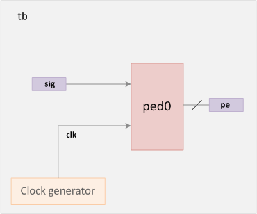
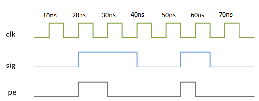
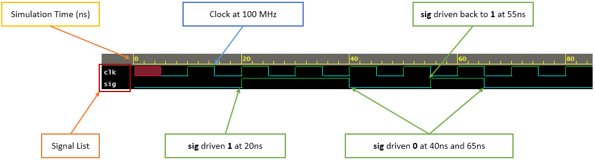
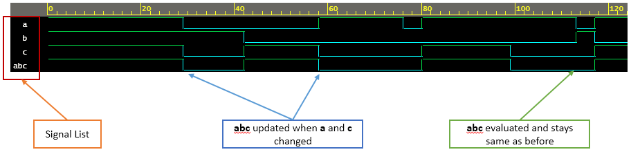

# Verilog 模拟基础

Verilog 是一种硬件描述语言，设计人员无需模拟其 RTL 设计即可将其转换为逻辑门。那么为什么还需要模拟仿真呢？

<p style="text-align:center"></p>

仿真是一种在不同时间对设计应用不同输入激励以检查 RTL 代码是否按照预期方式运行的技术。从本质上讲，仿真是用于验证设计的稳健性的被广泛采用的技术。它也类似于制造芯片在现实世界中的使用方式以及它对不同输入的反应方式。

例如，上面的设计表示带有输入时钟和信号的上升沿检测器，这些时钟和信号以周期性间隔进行评估，以找到如图所示的输出 pe。仿真让我们能够查看相关信号的时序图，以了解 Verilog 中的设计描述实际上是如何表现的。

<p style="text-align:center"></p>

有几家 EDA 公司开发了能够为设计的各种输入计算输出的模拟器。 Verilog 是根据离散事件执行模型定义的，不同的模拟器可以自由使用不同的算法来为用户提供一组一致的结果。 Verilog代码分为多个进程和线程，在模拟过程中可能会在不同的时间进行评估，稍后会涉及到。


### 示例

名为 `tb` 的测试台是一个容纳设计模块的容器。然而，在这个例子中，我们没有使用任何设计实例。有两个变量或信号可以在特定时间分配特定值。 `clk` 表示在测试台中生成的时钟。这是由 `always` 语句通过在每 `5ns` 后交替时钟值来完成的。初始块包含一组语句，它们在不同时间为两个信号分配不同的值。

```verilog
module tb;
    reg clk;
    reg sig;

    // Clock generation
    // Process starts at time 0ns and loops after every 5ns
    always #5 clk = ~clk;

    // Initial block : Process starts at time 0ns
    initial begin
        // This system task will print out the signal values everytime they change
        $monitor("Time = %0t clk = %0d sig = %0d", $time, clk, sig);

        // Also called stimulus, we simply assign different values to the variables
        // after some simulation "delay"
        sig = 0;
        #5 clk = 0;        // Assign clk to 0 at time 5ns
        #15  sig = 1;      // Assign sig to 1 at time 20ns (#5 + #15)
        #20  sig = 0;      // Assign sig to 0 at time 40ns (#5 + #15 + #20)
        #15  sig = 1;      // Assign sig to 1 at time 55ns (#5 + #15 + #20 + #15)
        #10  sig = 0;      // Assign sig to 0 at time 65ns (#5 + #15 + #20 + #15 + #10)
        #20 $finish;       // Finish simulation at time 85ns
    end
endmodule
```

模拟器在执行上述测试台后提供以下输出。

仿真日志：

```bash
Time = 0 clk = x sig = 0
Time = 5 clk = 0 sig = 0
Time = 10 clk = 1 sig = 0
Time = 15 clk = 0 sig = 0
Time = 20 clk = 1 sig = 1
Time = 25 clk = 0 sig = 1
Time = 30 clk = 1 sig = 1
Time = 35 clk = 0 sig = 1
Time = 40 clk = 1 sig = 0
Time = 45 clk = 0 sig = 0
Time = 50 clk = 1 sig = 0
Time = 55 clk = 0 sig = 1
Time = 60 clk = 1 sig = 1
Time = 65 clk = 0 sig = 0
Time = 70 clk = 1 sig = 0
Time = 75 clk = 0 sig = 0
Time = 80 clk = 1 sig = 0
```

## 仿真波形是什么？

仿真使我们能够将设计和测试台信号转储为可以图形表示的波形，以分析和调试 RTL 设计的功能。下面显示的波形是从 EDA 工具获得的，显示了每个信号相对于时间的进程，与之前显示的时序图相同。

<p style="text-align:center"></p>

变量或导线值的每次变化都称为更新事件。并且进程对更新事件很敏感，因此每当更新事件发生时都会评估这些进程，并称为评估事件(evaluation event)。由于可能会任意评估多个进程，因此必须在事件队列(event queue)中跟踪更改的顺序。

当然，它们是按模拟时间排序的。在队列上放置新事件称为调度(schedule)。仿真时间用于指仿真器维护的时间值，以模拟被仿真电路所需的实际时间。上述示例的时间值在时序图中以纳秒 ns 显示。

```verilog
module des;
	wire abc;
	wire a, b, c;

	assign abc = a & b | c;  // abc is updated via the assign statement (process) whenever a, b or c change -> update event
endmodule
```

<p style="text-align:center"></p>

## 事件队列中的区域

Verilog 事件队列在逻辑上分为五个区域，可以在其中任意一个区域添加事件。但是，它只能从活动区域中移除。

|事件|描述|
|-|-|
|活跃(active)|发生在当前仿真时间，可以任意顺序处理|
|不活跃(inactive)|在当前模拟时间发生，但在所有活跃事件完成后处理|
|非阻塞(nonblocking)|在之前的某个时间进行评估，但在活跃和不活跃事件完成后的当前模拟时间内完成分配|
|监视器(monitor)|在所有活跃、非活跃和非阻塞事件完成后处理|
|未来(future)|发生在未来的某个模拟时间|

模拟周期是处理所有活动事件的地方。除少数情况外，该标准保证一定的调度顺序。例如， `begin-end` 块中的语句只会按照它们出现的顺序执行。

```verilog
module tb;
	reg [3:0] a;
	reg [3:0] b;

	initial begin		// Statements are executed one after the other at appropriate simulation times
		a = 5;			// At time 0ns, a is assigned 5
		b = 2;			// In the same simulation step (time 0ns), b is assigned 2

		#10 a = 7;		// When simulation advances to 10ns, a is assigned 7
	end
endmodule
```

事件队列定义给 `b` 赋值应该在给 `a` 赋值之后发生。


