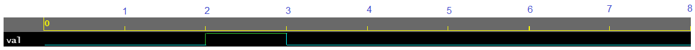
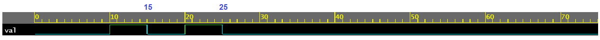
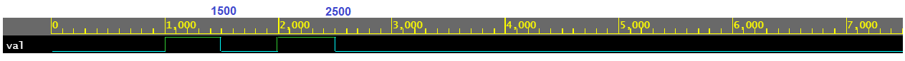

# Verilog 时间尺度

Verilog 模拟取决于如何定义时间，因为模拟器需要知道 `#1` 在时间方面的含义。 `timescale` 编译器指令指定其后模块的时间单位和精度。

## 语法

```verilog
`timescale <time_unit>/<time_precision>

// Example
`timescale 1ns/1ps
`timescale 10us/100ns
`timescale 10ns/1ns
```

`time_unit` 是延迟和仿真时间的度量，而 `time_precision` 指定延迟值在用于仿真之前如何四舍五入。

使用以下时间尺度结构在同一设计中使用不同的时间单位。请记住，设计中的延迟规范是不可综合的，也不能转换为硬件逻辑。

- 用于基本测量单位和时间精度的 `timescale` ；
- `$printtimescale` 系统任务显示时间单位和精度；
- `$time` 和 `$realtime` 系统函数返回当前时间，并且可以使用另一个系统任务 `$timeformat` 更改默认报告格式。

|字符|时间单位|
|:-:|:-:|
| `s` | seconds |
| `ms` | milliseconds |
| `us` | microseconds |
| `ns` | nanoseconds |
| `ps` | picoseconds |
| `fs` | femtoseconds |

这些规范中的整数可以是 1、10 或 100，指定单位的字符串可以采用上表中提到的任何值。

## 例1：1ns/1ns

```verilog
// Declare the timescale where time_unit is 1ns
// and time_precision is also 1ns
`timescale 1ns/1ns

module tb;
	// To understand the effect of timescale, let us
	// drive a signal with some values after some delay
    reg val;

    initial begin
        // Initialize the signal to 0 at time 0 units
        val <= 0;

        // Advance by 1 time unit, display a message and toggle val
        #1 		$display ("T=%0t At time #1", $realtime);
        val <= 1;

        // Advance by 0.49 time unit and toggle val
        #0.49 	$display ("T=%0t At time #0.49", $realtime);
        val <= 0;

        // Advance by 0.50 time unit and toggle val
        #0.50 	$display ("T=%0t At time #0.50", $realtime);
        val <= 1;

        // Advance by 0.51 time unit and toggle val
        #0.51 	$display ("T=%0t At time #0.51", $realtime);
        val <= 0;

            // Let simulation run for another 5 time units and exit
        #5 $display ("T=%0t End of simulation", $realtime);
    end
endmodule
```

第一个延迟语句使用 `#1` 使模拟器恰好等待 1 个时间单位，该时间单位使用 `timescale` 指令指定为 1ns。第二个延迟语句使用 `0.49`，它小于半个时间单位。然而，时间精度被指定为 1ns，因此模拟器不能小于 1ns，这使得它对给定的延迟语句进行舍入并产生 0ns。所以第二次延迟未能提前模拟时间。

第三个延迟语句恰好使用了一半的时间单位 `#0.5` ，模拟器将再次将该值四舍五入以得到 #1，它表示一个完整的时间单位。所以这会在 `T=2ns` 时打印出来。

第四个延迟语句使用超过一半时间单位的值并进行四舍五入，从而使显示语句在 `T=3ns` 时打印。

模拟按预期运行了 8ns，但请注意波形在每纳秒之间没有更小的间隔。这是因为时间的精度与时间单位相同。

<p style="text-align:center"></p>

## 例2：10ns/1ns

与上一个示例相比，此示例中所做的唯一更改是时间刻度已从 1ns/1ns 更改为 10ns/1ns。所以时间单位是10ns，精度是1ns。

```verilog
// Declare the timescale where time_unit is 10ns
// and time_precision is 1ns
`timescale 10ns/1ns

// NOTE: Testbench is the same as in previous example
module tb;
	// To understand the effect of timescale, let us
	// drive a signal with some values after some delay
    reg val;

    initial begin
        // Initialize the signal to 0 at time 0 units
        val <= 0;

        // Advance by 1 time unit, display a message and toggle val
        #1 		$display ("T=%0t At time #1", $realtime);
        val <= 1;

        // Advance by 0.49 time unit and toggle val
        #0.49 	$display ("T=%0t At time #0.49", $realtime);
        val <= 0;

        // Advance by 0.50 time unit and toggle val
        #0.50 	$display ("T=%0t At time #0.50", $realtime);
        val <= 1;

        // Advance by 0.51 time unit and toggle val
        #0.51 	$display ("T=%0t At time #0.51", $realtime);
        val <= 0;

            // Let simulation run for another 5 time units and exit
        #5 $display ("T=%0t End of simulation", $realtime);
    end
endmodule
```

实际仿真时间是用 `#` 指定的延迟乘以时间单位，然后根据精度四舍五入。然后第一个延迟语句将产生 10ns，第二个给出 14.9，四舍五入为 15ns。

第三条语句同样增加了 5ns ( $0.5 \times 10ns$ )，总时间变为 20ns。第四个增加了另一个 5ns ( $0.51 \times 10$ ) 以将总时间提前到 25ns。

仿真日志：

```bash
T=10 At time #1
T=15 At time #0.49
T=20 At time #0.50
T=25 At time #0.51
T=75 End of simulation
```

注意到波形的基本单位是十纳秒，精度为 1ns。

<p style="text-align:center"></p>

## 例3：1ns/1ps

与上一个相比，此示例中唯一的变化是时间刻度从 1ns/1ns 更改为 1ns/1ps。所以时间单位是1ns，精度是1ps。

```verilog
// Declare the timescale where time_unit is 1ns
// and time_precision is 1ps
`timescale 1ns/1ps

// NOTE: Testbench is the same as in previous example
module tb;
    // To understand the effect of timescale, let us
    // drive a signal with some values after some delay
    reg val;

    initial begin
        // Initialize the signal to 0 at time 0 units
        val <= 0;

        // Advance by 1 time unit, display a message and toggle val
        #1 		$display ("T=%0t At time #1", $realtime);
        val <= 1;

        // Advance by 0.49 time unit and toggle val
        #0.49 	$display ("T=%0t At time #0.49", $realtime);
        val <= 0;

        // Advance by 0.50 time unit and toggle val
        #0.50 	$display ("T=%0t At time #0.50", $realtime);
        val <= 1;

        // Advance by 0.51 time unit and toggle val
        #0.51 	$display ("T=%0t At time #0.51", $realtime);
        val <= 0;

        // Let simulation run for another 5 time units and exit
        #5 $display ("T=%0t End of simulation", $realtime);
    end
endmodule
```

看到时间单位缩放以匹配新的精度值 1ps。另请注意，时间以最小分辨率表示，在这种情况下为皮秒。

仿真日志：

```bash
T=1000 At time #1
T=1490 At time #0.49
T=1990 At time #0.50
T=2500 At time #0.51
T=7500 End of simulation
```

<p style="text-align:center"></p>


